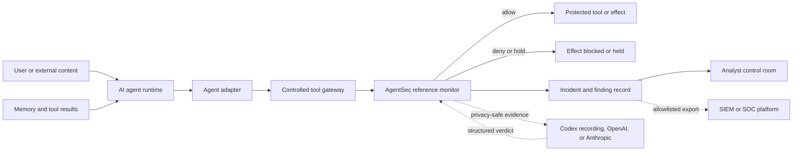
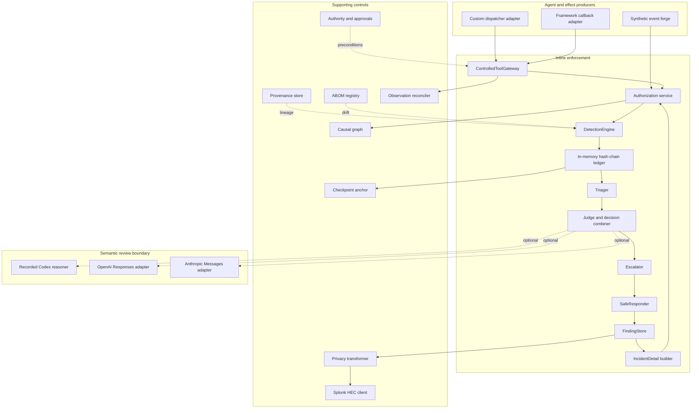
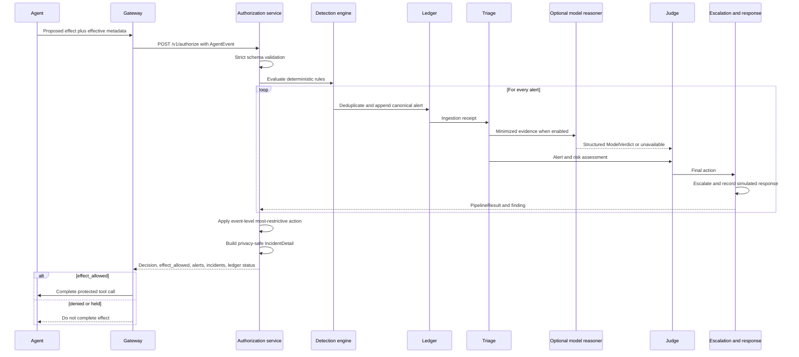
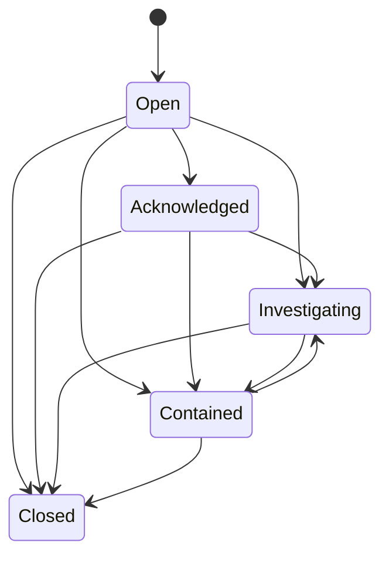
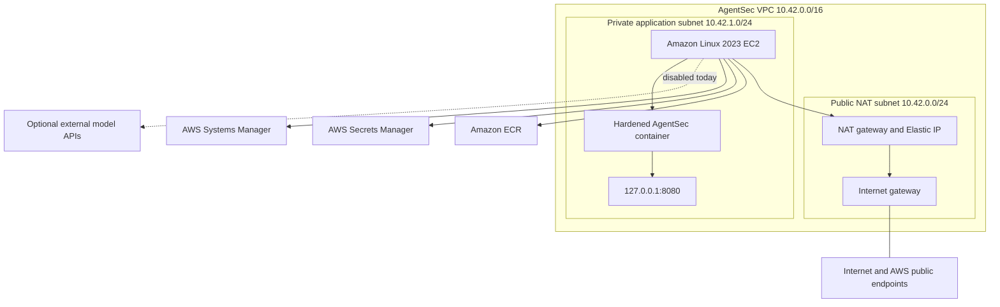
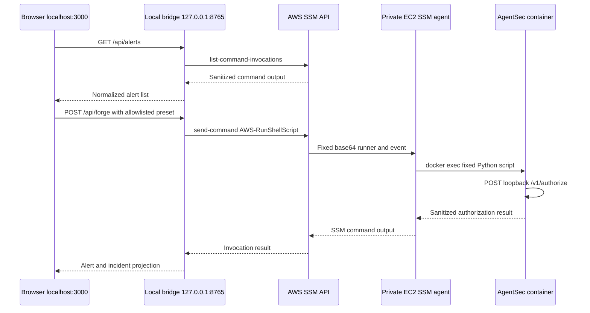
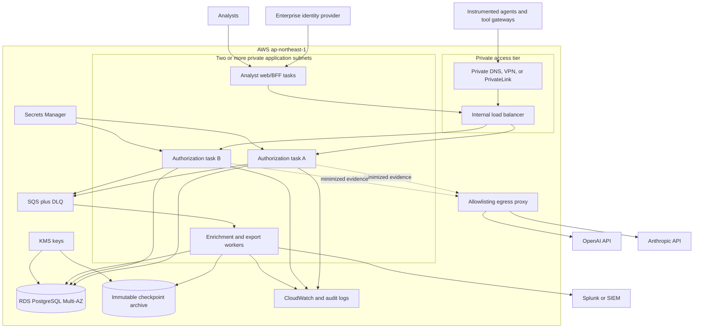

# AgentSec detailed architecture specification

Document status: implemented research PoC plus recommended pilot target  
Architecture version: 1.1  
Updated: 2026-07-22  
Primary deployment region: AWS Asia Pacific (Tokyo), `ap-northeast-1`

## 1. Purpose

AgentSec is a provider-neutral reference monitor and closed-loop security
operations workflow for AI agents. It evaluates a proposed agent effect before
the effect is completed, applies deterministic security policy, records an
explainable incident, optionally obtains a read-only semantic judgment from an
AI model, and produces an escalation and safe response disposition.

The executable lifecycle is:

```text
Agent event -> Detection -> Ingestion -> Triage -> Judgment
            -> Escalation -> Response -> Finding and incident detail
```

This document describes:

- the architecture implemented in this repository;
- the local analyst UI and its AWS Systems Manager bridge;
- the private single-instance Tokyo deployment currently used for the demo;
- technical and deployment requirements;
- security boundaries and failure behavior;
- a recommended durable, multi-AZ pilot architecture;
- the work required to move from the PoC to that pilot.

It is the canonical architecture document. More focused material remains in the
[threat model](threat-model.md), [data-handling specification](data-handling.md),
[limitations](limitations.md), and
[Tokyo operations runbook](../deploy/ec2-tokyo/OPERATIONS.md).

## 2. Status vocabulary

Every architecture claim uses one of these states:

| State | Meaning |
| --- | --- |
| **Implemented** | Executable source and automated tests exist in this repository. |
| **Deployed PoC** | The capability is present in the approved single-node Tokyo demo. |
| **Deployment-supporting** | Code or infrastructure exists, but the capability is disabled or uses a fake transport. |
| **Target** | Recommended for a pilot or production design; it is not implemented by this repository. |
| **Out of scope** | Deliberately excluded from this release. |

The current source is newer than the deployed EC2 image. The source returns
privacy-safe authoritative incident details from the exact pipeline result. The
currently approved EC2 image continues to expose the older summary response, so
the local bridge labels reconstructed detail as **MVP REPLAY**. No deployed AWS
resource or image is changed merely by updating this document or the source.

## 3. Architectural goals and non-goals

### 3.1 Goals

1. Evaluate every protected effect before execution.
2. Keep the deterministic policy path operational without an AI model.
3. Prevent a model from granting authority, approving an action, calling a
   response tool, or weakening a deterministic decision.
4. Preserve provenance and effective authority across agent handoffs.
5. Produce evidence explaining why an alert was generated and how its risk was
   scored.
6. Deduplicate alerts and make ledger mutation detectable.
7. Minimize evidence before it crosses a model, UI, or SIEM boundary.
8. Run the backend without a public IP or inbound security-group rule.
9. Support Codex recorded review now and OpenAI or Anthropic APIs later through
   the same validated verdict contract.
10. Make evaluation reproducible through versioned fixtures, schemas, reports,
    and release gates.

### 3.2 Non-goals of the current PoC

- General semantic proof that an arbitrary prompt caused an effect.
- A complete endpoint, network, identity, or data-loss-prevention product.
- Durable multi-tenant incident storage.
- A production immutable audit ledger or hardware-backed signing service.
- Real containment of hosts, identities, tickets, mail, or cloud resources.
- High availability, autoscaling, backup, or disaster recovery.
- Public dashboard hosting.
- A claim that Tokyo EC2 location controls the processing location of an
  external model provider.

## 4. Design principles and invariants

The following invariants are architectural, not model prompts:

| Invariant | Enforcement mechanism |
| --- | --- |
| Pre-effect enforcement | `ControlledToolGateway` calls `SecurityPipeline` before a mock tool can complete. |
| Authority attenuation | Child grants must be a subset of the parent grant and cannot extend lifetime, depth, or execution count. |
| Most-restrictive decision | `deny > require_approval > allow_with_obligations > allow`. |
| AI cannot weaken policy | Only `semantic_hold` may tighten a decision; weaker model recommendations are rejected. |
| Model failure is non-fatal to policy | Provider failures normalize to deterministic fallback. |
| Untrusted evidence is data | Provider instructions state that evidence is data and model citations must match supplied evidence IDs. |
| Raw content is excluded | Model, incident, UI, and SOC payloads are constructed from allowlists rather than serialized and redacted afterward. |
| Response safety | PoC response actions are records with `simulated=true`; no real response connector is available. |
| Private runtime | EC2 has no public IP, no ingress rules, and publishes the service only on instance loopback. |
| Immutable releases | ECR tags are immutable and service deployment takes an image digest URI. |

## 5. System context



The protected tool is inside the enforcement boundary only when invocation is
forced through the gateway or an equivalent independent proxy. An SDK callback
alone is telemetry, not a complete security boundary.

### 5.1 Actors

| Actor | Responsibility | Trust position |
| --- | --- | --- |
| Agent runtime | Proposes an operation and supplies effect metadata. | Untrusted for high-risk authorization. |
| Agent adapter | Normalizes framework-specific proposals into `AgentEvent`. | Parsing boundary; not sufficient proof of effect. |
| Controlled gateway | Makes the authorization call and conditionally invokes the tool. | Required inline enforcement point. |
| Reference monitor | Detects policy violations and returns the final disposition. | Deterministic trusted computing base for the PoC. |
| Semantic reasoner | Reviews minimized evidence and returns a typed verdict. | Outside the authority boundary. |
| Analyst | Investigates, acknowledges, and eventually closes incidents. | Privileged human; target architecture requires authenticated RBAC. |
| AWS operator | Builds, deploys, verifies, and replaces AgentSec-owned resources. | Privileged infrastructure role with change controls. |
| SIEM | Receives an allowlisted finding projection. | External data-processing boundary. |

## 6. Implemented logical architecture



The executable `SecurityPipeline` directly composes detection, ingestion,
triage, judgment, escalation, response, and finding storage. Authority,
provenance, ABOM, graph, checkpoint, observer, and Splunk components are
implemented reference controls exercised by tests and the synthetic workflow;
they are not all invoked by the minimal HTTP `/v1/authorize` path.

## 7. End-to-end authorization sequence



Important behavior:

- One event can produce multiple alerts.
- Each alert traverses all six stages.
- The event action is the maximum action rank across all alert judgments.
- When the event-level action is stricter than an individual alert action, that
  alert's judgment, escalation, response, finding, and timeline are recomputed
  to reflect the event-wide result.
- An event with no detector matches currently defaults to `allow`. Therefore
  detector coverage and an independent gateway are critical assumptions.

## 8. Core component specification

| Component | Source | Inputs | Outputs | State | Status |
| --- | --- | --- | --- | --- | --- |
| Strict contracts | [`contracts.py`](../src/agentsec/contracts.py) | Typed metadata | Pydantic models | None | Implemented |
| Detection engine | [`detection.py`](../src/agentsec/detection.py) | `AgentEvent` | Zero or more `SecurityAlert` objects | Rule list | Implemented |
| Alert ledger | [`ingestion.py`](../src/agentsec/ingestion.py) | `SecurityAlert` | `IngestionReceipt` | Process memory | Implemented |
| Triager | [`workflow.py`](../src/agentsec/workflow.py) | Alert | Risk score and priority | None | Implemented |
| Semantic reasoner | [`reasoning.py`](../src/agentsec/reasoning.py) | Alert and triage | `ModelVerdict` | Recording or provider call record | Implemented/supporting |
| Judge | [`workflow.py`](../src/agentsec/workflow.py) | Deterministic action and optional model verdict | `Judgment` | Policy version | Implemented |
| Escalator | [`workflow.py`](../src/agentsec/workflow.py) | Alert, triage, judgment | Queue, case ID, escalation level | None | Implemented with synthetic routing |
| Safe responder | [`workflow.py`](../src/agentsec/workflow.py) | Judgment and escalation | `ResponseRecord` | None | Implemented, simulation only |
| Finding store | [`findings.py`](../src/agentsec/findings.py) | Alert and state transition | `Finding` and audit entries | Process memory | Implemented |
| Incident builder | [`incidents.py`](../src/agentsec/incidents.py) | Exact `PipelineResult` | Privacy-safe `IncidentDetail` | None | Implemented in current source |
| Pipeline orchestrator | [`pipeline.py`](../src/agentsec/pipeline.py) | `AgentEvent` | `EventProcessingResult` | Composed in-memory stores | Implemented |
| HTTP service | [`service.py`](../src/agentsec/service.py) | Authenticated JSON | `AuthorizationResponse` | One pipeline per process | Implemented |
| Authority service | [`authority.py`](../src/agentsec/authority.py) | Signed grants | Effective grant or error | Use counters in memory | Implemented reference |
| Approval service | [`approval.py`](../src/agentsec/approval.py) | Bound approval token and event | Single-use approval decision | Nonces in memory | Implemented reference |
| Provenance store | [`provenance.py`](../src/agentsec/provenance.py) | Source/tool/handoff/memory lineage | Conservative trust class | Process memory | Implemented reference |
| ABOM registry | [`abom.py`](../src/agentsec/abom.py) | Signed manifest and runtime observation | `AbomDiff` | Process memory | Implemented reference |
| Causal graph | [`graph.py`](../src/agentsec/graph.py) | Event processing results | Source-to-sink paths | Process memory | Implemented reference |
| Checkpoint anchor | [`checkpoints.py`](../src/agentsec/checkpoints.py) | Ledger head | Signed checkpoint and verification | Process memory | Implemented reference |
| Effect observer | [`observation.py`](../src/agentsec/observation.py) | SDK and gateway reports | Telemetry inconsistency findings | None | Implemented reference |
| Privacy transformer | [`privacy.py`](../src/agentsec/privacy.py) | Alert/result metadata | Model and SOC allowlist projections | None | Implemented |
| Splunk client | [`splunk.py`](../src/agentsec/splunk.py) | `SocFindingExport` | Delivery receipt or dead letter | In-memory sent set/dead letters | Implemented with fake tests; live disabled |

## 9. Input and contract architecture

### 9.1 AgentEvent

`AgentEvent` is a metadata-only statement about a proposed effect. Its JSON
Schema is committed as
[`action-event.schema.json`](../schemas/generated/action-event.schema.json).

Required semantic groups are:

| Group | Fields | Purpose |
| --- | --- | --- |
| Identity | `tenant_id`, `flow_id`, `agent_id`, `event_id` | Scope and correlate the operation. |
| Effect | `operation`, `resource`, `destination`, `is_effectful` | Describe what would happen. |
| Provenance | `source_type`, `source_id`, `source_trust` | Record where influence originated. |
| Classification | `data_classes` | Identify secret or otherwise governed data. |
| Authority | `authority_operations`, `approval_present` | Declare effective operations and approval state. |
| Tool contract | `tool_name`, declared and observed schema digests | Detect MCP or tool drift. |
| Detection hints | `indicators` | Carry normalized evidence such as memory poisoning. |
| Extension metadata | `attributes` | Strict string map; prohibited from model, incident, and SOC output. |

Pydantic models use `extra="forbid"`, stripped strings, bounded field sizes, and
timezone-aware event timestamps. A request that does not satisfy the contract
returns `400 invalid_request` from the HTTP service.

### 9.2 Core output contracts

| Contract | Version | Description |
| --- | --- | --- |
| `AuthorizationResponse` | 1.1.0 in current source | Overall action, effect flag, alert summaries, incident details, and ledger status. |
| `SecurityAlert` | 1.0.0 | Detector result and deterministic recommendation. |
| `PipelineResult` | Generated schema | Exact record across all six workflow stages for one alert. |
| `IncidentDetail` | 1.0.0 | Allowlisted analyst explanation built from a `PipelineResult`. |
| `ModelVerdict` | Generated schema | Provider-neutral structured semantic recommendation. |
| `Finding` | 1.0.0 | Deduplicated analyst case with immutable audit transitions. |
| `SocFindingExport` | 1.0.0 | Minimized SIEM projection. |

All generated schemas live in [`schemas/generated`](../schemas/generated/) and
are regenerated or verified with `make schemas` and `make check-schemas`.

## 10. Detection architecture

The engine runs all rules and may emit more than one alert for an event.

| Detector | Match condition | Severity | Confidence | Deterministic recommendation |
| --- | --- | ---: | ---: | --- |
| `DET-INDIRECT-INJECTION-001` | Untrusted/adversarial source plus `indirect_prompt_injection` indicator | High | 0.94 | Deny |
| `DET-SECRET-EGRESS-001` | `external.send` or `external.upload` with `secret` data class | Critical | 0.99 | Deny |
| `DET-AUTHORITY-001` | Effectful operation absent from effective authority operations | High | 1.00 | Deny |
| `DET-MEMORY-POISONING-001` | Memory source, `memory_poisoning` indicator, and effectful event | High | 0.96 | Deny |
| `DET-MCP-DRIFT-001` | Declared and observed tool schema digests differ | High | 1.00 | Require approval |
| `DET-DESTRUCTIVE-APPROVAL-001` | Delete, isolate, or revoke without approval | High | 1.00 | Require approval |

Alert identity is deterministic for the tuple:

```text
tenant_id | agent_id | alert_type | resource | flow_id
```

The SHA-256 digest of that tuple is used as the fingerprint. The alert ID and
finding ID use stable prefixes plus the first 32 hexadecimal characters. This
enables idempotent duplicate behavior within one running process.

## 11. Ingestion and integrity architecture

The PoC ledger stores canonical alert objects in order and creates each receipt
as:

```text
current_hash = SHA256(canonical_alert_bytes || previous_hash || sequence)
```

Properties:

- sequence starts at 1;
- the genesis hash is 64 zeroes;
- duplicate fingerprints return their original receipt with `duplicate=true`;
- mutation, removal, insertion, or reordering is detected at verification;
- a separate PoC checkpoint anchor signs a sequence and ledger head.

Limitations:

- the ledger and checkpoint anchor are both in process memory;
- the HMAC signer is a reference implementation, not KMS/HSM custody;
- process restart loses the ledger;
- `ledger_verified=false` is reported but the minimal HTTP service does not yet
  turn it into a separate platform-wide circuit breaker.

The target design persists canonical records transactionally, writes signed
checkpoint heads to a separate immutable store, and pages on any integrity
failure.

## 12. Triage architecture

Triage is deterministic and reproducible.

### 12.1 Score calculation

```text
risk = severity base
     + 3 when confidence >= 0.95
     + 2 when provenance is external-untrusted or suspected-adversarial
risk = min(risk, 100)
```

| Severity | Base score |
| --- | ---: |
| Info | 10 |
| Low | 25 |
| Medium | 50 |
| High | 75 |
| Critical | 95 |

| Final score | Priority |
| --- | --- |
| 90-100 | P0 |
| 70-89 | P1 |
| 40-69 | P2 |
| 0-39 | P3 |

`IncidentDetail.risk_contributions` records every contribution and, when
necessary, a negative score-ceiling contribution. Construction fails if the
contributions do not exactly reproduce the stored triage score. The scoring
contract is versioned as `triage-2026-07-22.1` in the incident detail.

### 12.2 Enrichment

The authoritative incident builder produces six metadata-only enrichments:

1. source provenance;
2. authority intersection;
3. data classification;
4. destination class;
5. tool contract drift;
6. memory persistence.

Each enrichment includes a status, summarized value, evidence reference,
source, and impact. Sensitive source, resource, destination, and detector
evidence values are represented by truncated SHA-256 references rather than raw
values.

## 13. Judgment and model architecture

### 13.1 Decision combiner

The action order is fixed:

```text
deny > require_approval > allow_with_obligations > allow
```

Critical alerts fail closed to `deny`. For every other result, deterministic
policy remains the initial decision. A model verdict can only influence the
final action in `semantic_hold` mode, and only when it is more restrictive.

### 13.2 AI modes

| Mode | Model called | Can affect final action | Behavior |
| --- | --- | --- | --- |
| `off` | No | No | Fully deterministic. |
| `shadow` | Yes | No | Record and compare the verdict. |
| `advisory` | Yes | No | Show an analyst recommendation. |
| `semantic_hold` | Yes | Tighten only | May add a hold or denial; cannot weaken policy. |

### 13.3 Provider-neutral boundary

`SecurityReasoner.analyze(alert, triage)` returns one locally validated
`ModelVerdict` containing provider, exact model ID, action, confidence, evidence
IDs, reason codes, and uncertainty.

Implemented reasoners:

- `RecordedCodexReasoner`: versioned offline verdicts used by the current demo;
- `OpenAIResponsesReasoner`: live-capable adapter, disabled by profile;
- `AnthropicMessagesReasoner`: live-capable adapter, disabled by profile.

Live provider adapters:

- receive `ModelEvidenceBundle`, not the raw event;
- accept only HTTPS endpoints with exact host and path allowlists;
- use schema-constrained output;
- validate JSON locally with Pydantic;
- reject evidence IDs that were not supplied;
- reject unexpected model IDs;
- normalize timeout, refusal, malformed JSON, and schema failure to
  `ModelUnavailableError`;
- record request ID, model ID, token usage, latency, and output digest without
  storing the API key.

The OpenAI request sets `store=false`. Live deployment still requires provider
privacy, retention, residency, and contractual approval. The text “Tokyo” in a
profile name describes the EC2 caller location, not provider processing
residency.

### 13.4 Model failure behavior

| Failure | Current behavior | Required pilot behavior |
| --- | --- | --- |
| Provider timeout or network error | Deterministic fallback; timeline records model unavailable. | Same, plus metric and alert after threshold. |
| Refusal or truncated response | Deterministic fallback. | Same. |
| Invalid structured output | Deterministic fallback. | Same, retain only safe validation metadata. |
| Unknown evidence citation | Reject verdict and fall back. | Same. |
| Model suggests weaker action | Record `MODEL_RELAXATION_REJECTED`. | Same; invariant test required at release. |
| Model unavailable in semantic hold | Deterministic action continues. | Policy owner must explicitly approve this availability/safety tradeoff. |

## 14. Escalation, response, and findings

### 14.1 Escalation matrix

| Condition | Level | Queue | Case behavior |
| --- | --- | --- | --- |
| P0 and deny | `incident_page` | `soc-critical` | Synthetic case ID created. |
| Any other deny | `soc_urgent` | `soc-urgent` | Synthetic case ID created. |
| Require approval | `review_queue` | `security-approval` | Synthetic case ID created. |
| Allow | `none` | None | No case. |

### 14.2 Safe response

PoC response actions are one or more of:

- `record_only`;
- `hold_for_approval`;
- `block_effect`;
- `quarantine_session`.

They are always marked `simulated=true`. A denied event is prevented at the
mock gateway and its finding transitions to `contained`. There is no production
EDR, IAM, ticketing, mail, or orchestration connector.

### 14.3 Finding lifecycle



Every transition appends an actor, reason, source status, target status, and
timestamp. Closed is terminal in the current model.

## 15. Incident-detail architecture

The current source builds the analyst record directly from the exact
`PipelineResult` that produced the authoritative action. It does not run the
event through a second pipeline.

`IncidentDetail` contains:

- event context with hashed source/resource/destination references;
- alert identity, detector, confidence, reason codes, and hashed evidence;
- ledger sequence and chain hashes;
- triage score, priority, reasons, and reproducible contributions;
- six enrichment facts;
- deterministic, model, and final judgments;
- escalation routing and case ID;
- response actions and whether the effect was allowed;
- finding status and audit history;
- the ordered six-stage timeline;
- validation assertions;
- redaction-policy version and reference count.

The validation status means “confirmed policy violation in the evaluated agent
event.” It does not claim that a synthetic event proves a real-world compromise.
The complete contract is
[`incident-detail.schema.json`](../schemas/generated/incident-detail.schema.json).

### 15.1 Trace modes

| UI label | Source | Assurance |
| --- | --- | --- |
| `AUTHORITATIVE TRACE` | Incident returned by the updated service from the exact `PipelineResult`. | Highest available PoC assurance. |
| `MVP REPLAY` | Detail reconstructed inside the existing EC2 container and compared with service alert types and final action. | Presentation fallback, not the original record. |
| `SUMMARY ONLY` | Sanitized authorization summary from an older SSM invocation. | No detailed stage evidence. |

## 16. Supporting security controls

### 16.1 Authority grants

Authority grants bind issuer, subject, tenant, environment, operations,
resources, destinations, data classes, validity window, delegation depth, and
execution limit. Delegation rejects any child scope not contained by the parent.
Scope wildcards are limited to exact strings or a trailing `*`.

Current signing uses `PocHmacSigner`. Target deployment uses asymmetric or KMS
signing, rotation, revocation, and durable execution counters.

### 16.2 Exact approvals

Approval tokens bind to the canonical event and policy version, have a validity
window, and are single use. An approval satisfies a required human decision; it
does not grant an operation that is outside effective authority.

### 16.3 Provenance

The provenance store propagates the most conservative trust class across source,
tool result, transformation, handoff, and memory references. A target system
must make provenance mandatory at every framework and tool boundary rather than
accepting it only from the agent.

### 16.4 Agent Bill of Materials

The signed ABOM manifest describes agent/build/instruction digests, model
profiles, tools, allowed data classes, destinations, and policy bundle. Runtime
observations identify unknown agents, unknown tools, changed schemas, new
operations, new destinations, and new data classes.

### 16.5 Causal graph

The metadata graph records source-to-agent, agent-to-resource,
resource-to-destination, destination-to-decision, and decision-to-finding edges.
It reconstructs paths within a flow. It is an investigation aid, not an inline
blocker in the current PoC.

### 16.6 Independent effect observation

The observer compares agent SDK phases with gateway observations and detects:

- a gateway completion missing from SDK telemetry;
- an SDK completion missing from gateway telemetry;
- SDK effect activity with no gateway observation.

Production needs an observation source independent of the protected agent, such
as an egress proxy, tool broker, cloud audit log, or network sensor.

### 16.7 SOC export

`PrivacyTransformer.soc_export` creates a new `SocFindingExport` from an
allowlist. The Splunk client requires HTTPS, an allowlisted hostname, and the
exact `/services/collector/event` path. Delivery is idempotent by finding ID;
failures create a safe dead letter. Production must persist and encrypt dead
letters and use indexer acknowledgment before calling delivery durable.

## 17. Data architecture

### 17.1 Classification

| Data class | Examples | Current handling | Target handling |
| --- | --- | --- | --- |
| Prohibited raw content | Prompts, model text, tool arguments/results, memory content, credentials | Must not enter model, incident, UI, or SIEM contracts. | Reject at ingress where possible; DLP/canary enforcement. |
| Restricted metadata | Tenant, agent, operation, resource/destination references, reason codes | In memory; minimized or hashed across boundaries. | Encrypted transactional storage with tenant isolation. |
| Security evidence | Alerts, judgments, timelines, finding audit, ledger hashes | In memory and sanitized response. | Encrypted database plus immutable checkpoint archive. |
| Secrets | Ingest token, provider keys, HEC token | Environment from Secrets Manager on EC2. | Secrets Manager with rotation and narrowly scoped task roles. |
| Release evidence | Schemas, synthetic reports, digests | Committed, non-secret artifacts. | Signed CI artifacts with retention policy. |

### 17.2 Current storage

| Store | Persistence | Contents |
| --- | --- | --- |
| Pipeline process memory | Until restart | Ledger, findings, authority counters, approvals, provenance, ABOM observations, graph, checkpoints. |
| Local bridge memory | Until restart | Recently forged rich alerts and a short polling cache. |
| SSM command history | AWS-managed temporary history | Sanitized remote command output used by the demo UI. |
| Repository reports | Durable in source tree | Synthetic evaluation and deployment evidence with no secret values. |

### 17.3 Recommended pilot persistence

Use PostgreSQL as the system of record to avoid split-brain transactions across
alerts, judgments, findings, audit entries, and an export outbox.

Recommended logical tables:

- `events`: unique tenant/event ID, metadata projection, received timestamp;
- `alerts`: fingerprint uniqueness, detector result, event foreign key;
- `ledger_entries`: monotonic producer sequence, canonical digest, previous hash;
- `triage_assessments`: score, priority, score-policy version;
- `judgments`: deterministic, model, and final actions;
- `model_calls`: provider metadata and output digest, never API keys/raw prompts;
- `escalations`: queue, external case reference, lifecycle state;
- `responses`: requested and completed response actions;
- `findings`: tenant-scoped incident aggregate;
- `finding_audit`: append-only state transitions;
- `incident_details`: versioned analyst projection or reproducible materialized view;
- `outbox`: transactional SIEM/notification messages;
- `approval_nonces`: single-use approval state;
- `authority_usage`: grant counters and revocation state;
- `abom_manifests` and `abom_observations`;
- `ledger_checkpoints`: KMS-signed heads and immutable archive reference.

Tenant ID must be present in every primary/unique key and every authorization
query. PostgreSQL row-level security is recommended as defense in depth, not as
the only tenant check.

### 17.4 Retention targets

Retention is not implemented. Initial pilot policy should be approved by legal,
privacy, and security owners. A reasonable starting proposal is:

| Record | Hot retention | Archive retention | Notes |
| --- | ---: | ---: | --- |
| Authorization decisions | 30 days | 365 days | Metadata only. |
| Findings and audit | 365 days | Policy-dependent | Preserve closure evidence. |
| Provider call metadata | 30 days | 90 days | No raw prompts or provider credentials. |
| SSM command output | Minimize | None for normal data plane | SSM is not a production event store. |
| Synthetic evaluation reports | Repository lifetime | Release archive | Non-sensitive fixtures only. |

## 18. HTTP and integration interfaces

### 18.1 Authorization service

| Method and path | Authentication | Purpose | Success |
| --- | --- | --- | --- |
| `GET /healthz` | None on loopback-only interface | Liveness probe | `200` with service status. |
| `POST /v1/authorize` | Bearer token, at least 32 characters | Evaluate one strict `AgentEvent` | `200 AuthorizationResponse`. |

Request controls:

- exact route matching;
- `application/json` required;
- maximum request size 1 MiB;
- constant-time bearer comparison;
- `Cache-Control: no-store`;
- no default request logging;
- invalid body or schema returns a generic error without echoing the event.

Current limitations are one shared bearer token, no user/role authorization,
no rate limit, no replay nonce, no request signature, no TLS at the process
boundary, and no distributed concurrency control. Loopback placement is
therefore mandatory for the PoC.

### 18.2 Local live UI bridge

| Method and path | Purpose |
| --- | --- |
| `GET /health` | Local bridge liveness. |
| `GET /api/alerts` | Read sanitized recent SSM decisions. |
| `POST /api/forge` | Submit exactly one allowlisted synthetic preset. |

Bridge controls:

- binds to loopback on port 8765;
- accepts only `localhost:8765` or `127.0.0.1:8765` host headers;
- CORS allowlist contains only the local UI origins on port 3000;
- accepts only an object containing the `preset` key;
- allows five fixed presets and never arbitrary shell input;
- invokes AWS CLI with argument arrays and `shell=false`;
- keeps AWS credentials and the EC2 ingest token out of the browser;
- emits generic AWS/remote failure errors;
- caches reads for four seconds and caps displayed remote alerts at 100.

The bridge is a demo adapter, not a production API tier.

## 19. Analyst UI architecture

The control room is a client-oriented Next.js/React application under
[`ui`](../ui/). It currently runs locally and polls the loopback bridge every
eight seconds.

Main views:

- Overview and incident queue;
- detailed incident tabs for overview, triage, enrichment, decision, response;
- policy catalog;
- evaluation results;
- provider and infrastructure integration status.

The incident view explicitly displays trace assurance level and why the event is
considered a policy violation. It also states whether response was simulated and
that the event is not proof of a real-world compromise.

The checked-in vinext/Cloudflare worker scaffold and optional D1 adapter are not
used by the current demo: `.openai/hosting.json` has no D1 or R2 binding, the UI
has no active database tables, and public hosting is disabled.

Target UI requirements:

- enterprise SSO with MFA;
- tenant-aware RBAC for viewer, analyst, incident commander, policy owner, and
  platform administrator;
- backend-for-frontend so the browser never receives cloud or service secrets;
- same-origin TLS API calls;
- audit of incident views, exports, acknowledgments, assignments, and state
  changes;
- pagination, stable cursors, and server-side filtering;
- WebSocket or server-sent events only after authenticated authorization;
- content security policy, secure cookies, CSRF controls, and dependency/SBOM
  management;
- accessible keyboard navigation and responsive layouts.

## 20. Technical stack

### 20.1 Backend

| Layer | Technology | Version or constraint | Rationale |
| --- | --- | --- | --- |
| Language | Python | Package supports >=3.9; container uses 3.12 | Small auditable implementation and strong data tooling. |
| Contract validation | Pydantic | 2.12.5 | Strict runtime validation and JSON Schema generation. |
| HTTP server | Python `ThreadingHTTPServer` | Standard library | Dependency-minimal PoC only. |
| HTTP client | `urllib.request` | Standard library | Dependency-minimal provider/HEC adapters. |
| Packaging | setuptools | Build backend | Installable `agentsec` CLI. |
| Test framework | `unittest` | Standard library | Offline deterministic suite. |
| Container base | Python Alpine | `python:3.12-alpine3.22` pinned by digest | Small immutable runtime. |

The standard-library HTTP server is not suitable as the final production edge.
The target should use an ASGI service behind a managed load balancer with bounded
workers, request deadlines, connection limits, TLS, and graceful shutdown.

### 20.2 Frontend

| Layer | Technology | Version |
| --- | --- | ---: |
| Framework | Next.js | 16.2.6 |
| UI runtime | React and React DOM | 19.2.6 |
| Language | TypeScript | 5.9.3 |
| Local/build adapter | vinext | 0.0.50 |
| Bundler | Vite | 8.0.13 |
| Lint | ESLint | 9.39.4 |
| Optional data adapter | Drizzle ORM | 0.45.2, currently unused |
| Node requirement | Node.js | >=22.13.0; an LTS release is recommended |

### 20.3 AWS PoC

| Capability | AWS or host service |
| --- | --- |
| Infrastructure as code | CloudFormation JSON templates |
| Network | Dedicated VPC, public NAT subnet, private application subnet, IGW, NAT gateway |
| Compute | One Amazon Linux 2023 `t3.small` EC2 instance |
| Image registry | ECR with immutable tags and scan-on-push |
| Secrets | AWS Secrets Manager |
| Administration | AWS Systems Manager Session Manager and Run Command |
| Runtime | Docker managed by systemd |
| Storage | Encrypted 16 GiB gp3 root volume |
| Audit/evidence | CloudFormation state, ECR scan, SSM execution, committed sanitized reports |

### 20.4 Recommended pilot additions

| Capability | Recommended service |
| --- | --- |
| Stateless API | ECS on Fargate across at least two private subnets |
| Private entry | Internal Application Load Balancer or private API Gateway integration |
| Durable relational state | RDS PostgreSQL Multi-AZ with encryption and automated backups |
| Async work | SQS queues with encrypted dead-letter queues |
| Immutable checkpoints | S3 versioning/Object Lock where governance permits, signed with KMS |
| Keys | Customer-managed KMS keys with separated key administration and usage roles |
| Identity | Cognito federation or enterprise IdP/Identity Center integration |
| Logs and metrics | CloudWatch Logs, metrics, alarms, and optional X-Ray/OpenTelemetry collector |
| Private AWS access | Interface/gateway VPC endpoints for ECR, SSM, Secrets Manager, CloudWatch, S3 |
| Controlled provider egress | NAT plus domain-aware egress proxy/firewall and explicit provider allowlist |
| Configuration | SSM Parameter Store for non-secret configuration; Secrets Manager for secrets |

## 21. Local development deployment

### 21.1 Requirements

- macOS or Linux;
- Python 3.9 or later;
- Node.js 22.13 or later, preferably current LTS;
- npm matching the selected Node distribution;
- Docker for container verification;
- AWS CLI v2 for the live Tokyo bridge;
- configured `agentsec-deploy` profile with only the required SSM permissions;
- network access to npm only during dependency installation;
- no provider credentials for the default recorded-Codex mode.

### 21.2 Local processes

```text
Browser :3000 -> vinext development server
Browser :3000 -> loopback bridge :8765
Bridge :8765 -> AWS CLI/SSM -> private Tokyo EC2 -> agentsec container :8080
```

For a backend-only local run:

```bash
AGENTSEC_INGEST_TOKEN='replace-with-at-least-32-random-characters' \
  PYTHONPATH=src python3 -m agentsec serve --host 127.0.0.1 --port 8080
```

For the local UI and existing Tokyo service, use the two-terminal procedure in
[`ui/README.md`](../ui/README.md).

## 22. Current AWS Tokyo deployment

### 22.1 Foundation topology



The foundation stack creates only new AgentSec-owned infrastructure. It accepts
no existing VPC or subnet IDs. The service stack uses foundation outputs.

### 22.2 Stack resources

`agentsec-demo-foundation` owns:

- VPC and DNS settings;
- internet gateway and attachment;
- public NAT subnet and route table;
- private application subnet and route table;
- NAT gateway and Elastic IP;
- immutable, encrypted, scan-on-push ECR repository.

`agentsec-demo-service` owns:

- no-ingress security group with outbound TCP 443 only;
- EC2 runtime role and instance profile;
- encrypted EC2 instance and root volume;
- systemd unit and hardened Docker runtime.

The dedicated runtime secret is named `agentsec-demo/runtime`. Its value is not
stored in this repository or deployment report.

### 22.3 Runtime hardening

- no public IP;
- no security-group ingress;
- SSM administration instead of SSH;
- IMDSv2 required with metadata tags disabled;
- encrypted gp3 root volume;
- image selected by ECR digest, not a moving tag;
- container runs as UID/GID 10001;
- read-only container filesystem;
- 64 MiB `noexec`, `nosuid` temporary filesystem;
- all Linux capabilities dropped;
- `no-new-privileges` enabled;
- service port published only as `127.0.0.1:8080`;
- runtime env file is mode 0600;
- health check calls loopback `/healthz`.

### 22.4 IAM

The EC2 role has:

- `AmazonSSMManagedInstanceCore`;
- read access to the single runtime secret ARN pattern;
- ECR authorization-token access;
- pull access to the single AgentSec repository.

It does not need permission to create, update, tag, or delete infrastructure.
Deployment credentials and runtime credentials are separate concerns.

### 22.5 Deployed snapshot

The approved 2026-07-22 snapshot records:

- both stacks at `CREATE_COMPLETE`;
- instance type `t3.small`;
- SSM online;
- no public IP and zero ingress rules;
- encrypted gp3 storage;
- healthy, digest-pinned container;
- benign allow and adversarial deny runtime checks;
- shadow mode with `codex-recorded-shadow`;
- no live OpenAI or Anthropic keys;
- no deployed UI.

Resource IDs, exact image digest, and sanitized evidence are in
[`ec2-tokyo-20260722.json`](../reports/deployment/ec2-tokyo-20260722.json).

## 23. Local UI-to-AWS data path



AWS credentials remain in the operator's local AWS configuration. The ingest
token is read only inside the container environment. Neither value is sent to
the browser.

## 24. Recommended pilot deployment

The single EC2 node is appropriate for a recorded demo but not for a shared
pilot. The recommended pilot separates synchronous authorization, asynchronous
SOC processing, persistent state, analyst access, and controlled model egress.



### 24.1 Synchronous versus asynchronous work

The authorization response must remain synchronous for:

- strict input validation;
- authority and approval validation;
- deterministic detection;
- mandatory policy decision;
- minimal durable decision/ledger transaction;
- final `effect_allowed` response.

The following should be asynchronous unless a policy explicitly makes them a
hold condition:

- non-blocking enrichments;
- advisory or shadow model review;
- SIEM export;
- notifications and ticket creation;
- causal graph materialization;
- checkpoint archival;
- analytics and reporting.

`semantic_hold` is the exception: the model call is on the synchronous path and
must have a short, bounded deadline plus deterministic failure behavior.

### 24.2 Multi-AZ state and concurrency

Stateless API tasks cannot use per-process sequence numbers or use counters. A
pilot needs:

- database transactions for alert fingerprint uniqueness;
- a producer or tenant-scoped ledger sequence allocated under lock;
- atomic approval-nonce consumption;
- atomic authority-use increments;
- transactional outbox insertion with the decision;
- optimistic versioning for analyst finding transitions;
- idempotency keys on authorization and response connector calls.

### 24.3 Private model egress

OpenAI and Anthropic endpoints are external HTTPS services. VPC endpoints do not
make those APIs private. The pilot should use:

- a dedicated egress subnet/path;
- domain and certificate-aware proxy or firewall rules;
- DNS logging and flow logs;
- exact provider hostname allowlists;
- no arbitrary URL from request data;
- separate provider API keys with usage limits;
- provider usage and cost alarms;
- an emergency switch to `AGENTSEC_AI_MODE=off` or `shadow`.

## 25. Network-flow requirements

### 25.1 Current PoC flows

| Source | Destination | Port/protocol | Purpose | Allowed |
| --- | --- | --- | --- | --- |
| Internet | EC2 | Any | Direct inbound access | No |
| EC2 | AWS/public HTTPS | TCP 443 | SSM, ECR, Secrets Manager | Yes through NAT |
| EC2 | Provider HTTPS | TCP 443 | Future model call | Network permits; application profile disabled |
| Host loopback | Container | TCP 8080 | Authorization service | Yes |
| Operator laptop | AWS SSM API | HTTPS | Management and demo bridge | Yes with AWS credentials |
| Browser | Local bridge | TCP 8765 | Sanitized UI API | Loopback only |

### 25.2 Pilot flows

Every pilot flow must be explicitly represented in security groups, route
tables, endpoint policies, and an architecture data-flow inventory. Required
flows include agent-to-private-entry, entry-to-API, API-to-database,
API-to-queue, worker-to-SIEM, task-to-Secrets Manager/KMS/CloudWatch, and
task-to-egress-proxy. Direct task-to-internet egress should be denied when the
proxy design is complete.

## 26. Identity and access requirements

### 26.1 Runtime roles

| Role | Minimum capability |
| --- | --- |
| Authorization API task | Read its service configuration/secret, decrypt with its key, write decision records, publish to one queue, emit telemetry. |
| SOC worker task | Consume one queue, update permitted incident fields, write outbox/dead letters, call approved SIEM endpoints. |
| UI/BFF task | Read incidents and apply analyst-authorized state changes; no provider or infrastructure credentials. |
| Deployment role | Create/update only AgentSec stacks and pass approved task roles; separate from runtime roles. |
| Security audit role | Read configuration, CloudTrail, logs, findings, and evidence; no mutation. |
| Break-glass role | Time-bound, MFA-protected, monitored, and not used by automation. |

### 26.2 Analyst RBAC

| Role | Permissions |
| --- | --- |
| Viewer | Read minimized incidents and dashboards. |
| Analyst | Viewer plus acknowledge, assign, comment, and investigate. |
| Incident commander | Analyst plus containment approval and closure. |
| Policy owner | Review/version policy and model profile changes; cannot deploy alone. |
| Platform administrator | Operate the service; cannot silently alter incident audit. |

High-impact actions require step-up authentication and separation of duties.

## 27. Configuration and secrets

### 27.1 Current environment variables

| Variable | Required | Purpose |
| --- | --- | --- |
| `AGENTSEC_INGEST_TOKEN` | Service: yes | Shared PoC bearer token, minimum 32 characters. |
| `AGENTSEC_BIND_HOST` | No | Service bind host. |
| `AGENTSEC_PORT` | No | Service port, default 8080. |
| `AGENTSEC_AI_MODE` | No | `off`, `shadow`, `advisory`, or `semantic_hold`. |
| `AGENTSEC_MODEL_PROFILE` | When AI enabled | Selected model profile. |
| `AGENTSEC_MODEL_REGISTRY` | No | Model registry JSON path. |
| `AGENTSEC_CODEX_RECORDING` | Recorded Codex mode | Recording JSON path. |
| `OPENAI_MODEL_ID` | Live OpenAI profile | Exact evaluated model ID; no source default. |
| `OPENAI_API_KEY` | Live OpenAI profile | Provider credential. |
| `ANTHROPIC_MODEL_ID` | Live Anthropic profile | Exact evaluated model ID; no source default. |
| `ANTHROPIC_API_KEY` | Live Anthropic profile | Provider credential. |

### 27.2 Secret requirements

- Never commit secrets or paste them into reports or chat.
- Never expose secrets through the browser, logs, health endpoints, or SSM
  standard output.
- Scope retrieval to one named secret per runtime role.
- Encrypt secrets with a customer-managed KMS key for a pilot.
- Rotate bearer/provider/SIEM credentials and support overlapping rotation.
- Use distinct credentials for development, test, demo, and pilot.
- Add automated secret scanning to CI and image scanning to release gates.
- Prefer workload identity and request signing over a long-lived shared bearer
  token in the target design.

## 28. Functional requirements

| ID | Requirement | Current status |
| --- | --- | --- |
| FR-001 | Normalize supported agent/tool proposals into strict `AgentEvent`. | Implemented for two adapter styles. |
| FR-002 | Evaluate protected effects before execution. | Implemented in synthetic gateway. |
| FR-003 | Detect indirect injection, secret egress, authority violation, memory poisoning, MCP drift, and missing destructive approval. | Implemented. |
| FR-004 | Emit multiple alerts for one event and combine them most-restrictively. | Implemented. |
| FR-005 | Deduplicate alerts by stable fingerprint. | Implemented in memory. |
| FR-006 | Produce ordered detection-to-response timelines. | Implemented. |
| FR-007 | Reproduce triage score from versioned contributions. | Implemented in incident detail. |
| FR-008 | Create/update findings and append auditable state transitions. | Implemented in memory. |
| FR-009 | Return an analyst-readable reason for the final decision. | Implemented in current source/UI. |
| FR-010 | Keep deterministic enforcement operational when AI is off or unavailable. | Implemented. |
| FR-011 | Prevent AI from weakening a deterministic action. | Implemented and tested. |
| FR-012 | Validate all provider verdicts against one local contract. | Implemented. |
| FR-013 | Export only allowlisted finding metadata to a SIEM. | Implemented contract; live delivery not enabled. |
| FR-014 | Detect contradictory SDK/gateway effect observations. | Implemented reference. |
| FR-015 | Verify ledger and checkpoint integrity. | Implemented in memory. |
| FR-016 | Present live alert summary and detailed investigation views. | Implemented local UI. |
| FR-017 | Restrict event forging to safe fixed presets. | Implemented local bridge. |
| FR-018 | Persist incidents, approvals, counters, and outbox across restart. | Target. |
| FR-019 | Authenticate analysts and authorize actions by role and tenant. | Target. |
| FR-020 | Execute real containment only through separately approved connectors. | Target and explicitly disabled. |

## 29. Security requirements

| ID | Requirement | Verification approach |
| --- | --- | --- |
| SR-001 | Protected tools must not be callable through an unmediated credential path. | Architecture review and integration tests. |
| SR-002 | Unknown/invalid authorization response must fail closed at the gateway. | Failure-injection tests. |
| SR-003 | Model output must never create authority, approval, or a weaker action. | Unit/property tests and policy review. |
| SR-004 | Raw prompt, response, tool argument, memory, credential, and token fields must not cross model/UI/SIEM boundaries. | Canary and schema allowlist tests. |
| SR-005 | Every external endpoint must use TLS and exact hostname/path allowlists. | Configuration tests and egress policy. |
| SR-006 | Authorization requests must be authenticated, replay-resistant, tenant-bound, and rate-limited. | Target API security tests. |
| SR-007 | Secrets must be encrypted, scoped, rotated, and absent from logs. | IAM/KMS review and secret scans. |
| SR-008 | Runtime containers must be non-root, read-only, capability-free, and digest-pinned. | IaC and runtime probe. |
| SR-009 | Internet-originated inbound access to the decision service must be prohibited. | Network/IaC tests. |
| SR-010 | Alert/finding audit must be append-only and independently checkpointed. | Mutation and checkpoint tests. |
| SR-011 | Tenant data must be isolated in storage, API authorization, cache, queue, and logs. | Cross-tenant negative tests. |
| SR-012 | Destructive response connectors require exact action binding, human approval, idempotency, and rollback where possible. | Connector certification suite. |
| SR-013 | Deployment and runtime roles must be separate and least privilege. | IAM policy analysis. |
| SR-014 | All administrative and analyst changes must be attributable to a human or workload identity. | Audit-log tests. |
| SR-015 | Public exposure and broad egress changes require explicit security approval. | Change-set policy gate. |

## 30. Non-functional requirements

Current PoC measurements prove functional behavior on a small corpus, not these
pilot service levels. The following are initial target values to validate during
load testing.

| ID | Area | Initial pilot target |
| --- | --- | --- |
| NFR-001 | Deterministic authorization latency | p95 <= 100 ms and p99 <= 250 ms inside the AWS region, excluding model calls. |
| NFR-002 | Semantic-hold latency | Hard deadline <= 3 seconds; policy-specific timeout behavior. |
| NFR-003 | Availability | 99.9% monthly for the authorization API during pilot. |
| NFR-004 | Recovery point | <= 5 minutes for incident state; zero accepted loss for committed authorization decisions where required. |
| NFR-005 | Recovery time | <= 60 minutes for pilot. |
| NFR-006 | Scale | Start at 50 requests/second sustained and 200 requests/second burst; prove by test. |
| NFR-007 | Payload | <= 1 MiB transport limit; recommended normalized event <= 32 KiB. |
| NFR-008 | Durability | Automated Multi-AZ database backup and tested point-in-time restore. |
| NFR-009 | Observability | Metrics/logs for every stage without prohibited raw content. |
| NFR-010 | Accessibility | WCAG 2.2 AA target for analyst UI. |
| NFR-011 | Browser support | Current and previous major versions of managed Chrome/Edge; validate Safari if required. |
| NFR-012 | Portability | Provider adapters remain behind `SecurityReasoner`; deterministic path has no provider dependency. |

Capacity targets must be replaced with measured values before pilot approval.

## 31. Observability architecture

### 31.1 Required metrics

- authorization requests, outcomes, and errors by tenant and policy version;
- stage latency for validation, detection, ingestion, triage, model, judgment,
  persistence, and response;
- alerts by type, severity, priority, and final action;
- detector match and no-match counts;
- duplicate fingerprint rate;
- ledger verification failures;
- model calls, timeouts, refusals, invalid outputs, token use, and cost estimate;
- model-versus-deterministic disagreement;
- queue depth, age, retry, and DLQ count;
- SIEM export success, duplicate, and failure count;
- database connections, latency, storage, replication, and backup state;
- gateway bypass/observation inconsistencies;
- response action success/failure when real connectors are introduced.

### 31.2 Logging rules

Logs may include IDs, classes, reason codes, versions, action, status, latency,
and hashed references. Logs must not include raw events, authorization headers,
API keys, prompt text, tool arguments/results, full memory content, or arbitrary
provider response bodies.

Use structured JSON with correlation fields:

```text
request_id, event_id, tenant_id, flow_id, alert_id, finding_id,
policy_version, model_profile_id, trace_id
```

### 31.3 Alarms

At minimum:

- any ledger/checkpoint integrity failure;
- sustained authorization 5xx or timeout rate;
- protected gateway unable to reach the reference monitor;
- provider error or spend threshold breach;
- queue/DLQ backlog;
- database failover or storage threshold;
- unexpected public route, security-group ingress, or non-digest image;
- secret access anomaly;
- raw-content canary detected in an output boundary.

## 32. Availability, scaling, and consistency

The current service serializes access to in-memory stores using a process lock.
This is safe for its bounded single-process demonstration but prevents
horizontal state sharing.

Pilot design rules:

1. API tasks are stateless except for request-local data.
2. Database uniqueness enforces event and alert idempotency.
3. Authorization and outbox insert commit in one transaction.
4. Workers use at-least-once delivery and idempotent consumers.
5. External response calls use stable idempotency keys.
6. A model call cannot hold a database transaction open.
7. Circuit breakers protect provider and SIEM dependencies.
8. Readiness checks include required configuration and database reachability;
   liveness checks do not depend on optional providers.
9. Graceful shutdown stops new authorization work and completes or rolls back
   in-flight transactions.
10. Load shedding preserves deterministic deny/hold policy under overload.

## 33. Failure-mode architecture

| Failure | Current PoC | Pilot requirement |
| --- | --- | --- |
| Invalid event | Generic 400; no event echo. | Same plus safe reason metrics. |
| Invalid/missing bearer | 401. | Workload identity/signature, tenant binding, and rate limit. |
| Detector throws | Request fails. | Fail closed for protected effects and page platform owner. |
| Model unavailable | Deterministic fallback. | Same with bounded timeout and circuit breaker. |
| Ledger invalid | Response reports false. | Stop or hold protected effects according to fail-closed policy. |
| Database unavailable | Not applicable. | Fail closed or apply an explicitly approved emergency policy; never silently allow. |
| Queue/SIEM unavailable | In-memory dead letter for Splunk reference. | Durable outbox/DLQ; authorization may continue if enforcement record committed. |
| Response connector fails | No real connector. | Keep effect blocked, record failure, retry safely, escalate to human. |
| Duplicate request | Alert deduplicated in process. | Durable idempotency response across tasks/restarts. |
| EC2/container restart | In-memory evidence lost. | Multi-AZ tasks and durable state. |
| Region outage | Service unavailable. | Document agent/gateway fail-closed behavior; optional secondary-region recovery after threat review. |
| UI unavailable | Enforcement unaffected. | Same; analyst notifications use independent channels. |

## 34. Build, test, and release architecture

### 34.1 Current gates

`make verify` composes:

- generated-schema drift check;
- generated-report drift check;
- complete Python test discovery;
- clean offline package installation;
- Python bytecode compilation;
- source secret scan;
- installed dependency consistency check;
- release audit generation;
- workflow, Codex-recording, evaluation-mode, and ablation execution.

UI gates are:

```bash
cd ui
npm run lint
npm test
```

`npm test` builds the UI and executes source-contract and rendered-HTML tests.

### 34.2 Release artifacts

- Python package source;
- JSON Schemas;
- deterministic evaluation records and manifest digests;
- Docker image built for `linux/amd64`;
- immutable ECR tag and resolved image digest;
- ECR vulnerability scan result;
- CloudFormation templates and reviewed change sets;
- sanitized deployment/runtime verification report.

### 34.3 Recommended CI/CD controls

1. Protected main branch and reviewed pull requests.
2. Pinned dependencies with automated update proposals.
3. SAST, dependency, license, secret, IaC, and container scans.
4. Unit, integration, contract, negative security, and load tests.
5. Reproducible image build with SBOM and signed provenance.
6. Sign image and verify signature before deployment.
7. Deploy by digest to a non-production environment.
8. Run runtime canary and synthetic adversarial checks.
9. Require manual approval for pilot/production promotion.
10. Use CloudFormation change sets and reject unexpected replacement/deletion.
11. Preserve release evidence and support fast rollback to the previous digest.

## 35. Test architecture

### 35.1 Current test layers

| Layer | Coverage |
| --- | --- |
| Contract | Strict Pydantic validation and generated schema drift. |
| Unit | Detection, triage, decisions, authority, approvals, provenance, redaction, providers. |
| Pipeline | Stage order, event-level combination, model failure, finding response. |
| Synthetic workflow | Protected versus unprotected tool effects and ground truth. |
| Privacy | Canary exclusion across model, incident, and SIEM boundaries. |
| Integrity | Ledger mutation and checkpoint verification. |
| Provider | Fake-transport OpenAI and Anthropic request/response validation. |
| Infrastructure | CloudFormation security controls, no-ingress topology, bootstrap hardening. |
| Runtime | SSM probe of health, binding, digest, benign allow, adversarial deny, canary non-echo. |
| UI | Lint, production build, source contract, and rendered HTML. |

### 35.2 Synthetic corpus

The versioned corpus covers:

- indirect prompt injection plus secret egress;
- persistent memory poisoning;
- confused-deputy authority expansion;
- MCP schema drift;
- benign inventory read;
- development and repository-visible holdout variants.

Evaluation modes include unprotected, telemetry-only, static allowlist,
sink-without-provenance, provenance-without-authority, deterministic,
Codex-shadow, and semantic-hold. These results demonstrate the included corpus,
not general real-world detection accuracy.

### 35.3 Pilot test additions

- cross-tenant isolation and authorization tests;
- database concurrency/idempotency tests;
- restart and failover tests;
- queue redrive and poison-message tests;
- provider latency/cost/failure chaos tests;
- API fuzzing and payload-boundary tests;
- browser security and RBAC tests;
- backup restoration and disaster recovery exercise;
- real but sandboxed connector certification;
- load, soak, and autoscaling tests;
- external penetration test and threat-model review.

## 36. Deployment procedure and gates

This section describes the architecture sequence. Exact commands and cleanup
controls remain in the [operations runbook](../deploy/ec2-tokyo/OPERATIONS.md).

### 36.1 PoC release sequence

1. Run all backend and UI verification gates.
2. Build a `linux/amd64` image from the pinned Docker base.
3. Validate the foundation and service CloudFormation templates.
4. Create and review a change set; initial stack actions must all be `Add`.
5. Execute the isolated foundation stack only after explicit approval.
6. Push one immutable ECR tag and wait for image scan completion.
7. Resolve the image digest.
8. Create the dedicated runtime secret without exposing its value.
9. Create/review the service change set using only foundation outputs.
10. Execute the service stack only after explicit approval.
11. Wait for SSM managed-node readiness and container health.
12. Run the sanitized runtime probe.
13. Record stack, image, network, IAM, and behavioral evidence.

### 36.2 Update strategy

EC2 user data runs only at first boot. An image parameter update alone does not
guarantee that bootstrap reruns. Publish a new digest, then use a reviewed
replacement service stack or explicitly replace only the AgentSec-owned
instance. Verify before retiring the prior approved instance.

### 36.3 Rollback

Rollback means deploying the last known-good image digest and validating the
runtime probe. Do not use moving tags. Schema/database rollback in the pilot must
follow expand/migrate/contract patterns so the previous application remains
compatible during rollback.

### 36.4 Cleanup boundary

Deployment approval does not authorize cleanup. Cleanup requires a separate
decision and may remove only resources whose exact ownership is recorded in the
two AgentSec stacks. Existing account resources are never cleanup targets.

## 37. Migration from PoC to pilot

### Phase 0: presentation MVP — complete in source

- Live local UI with SSM-backed alert feed.
- Six investigation tabs and validity explanation.
- Authoritative incident-detail contract in source.
- Recorded Codex shadow judgment.
- Safe synthetic alert presets.

### Phase 1: authoritative service update

- Build, scan, and deploy the updated service image by digest after separate
  approval.
- Verify `AuthorizationResponse` 1.1.0 and `AUTHORITATIVE TRACE` end to end.
- Add runtime-check assertions for incident details and privacy metadata.
- Preserve the current image digest as the rollback target.

### Phase 2: durable single-environment pilot foundation

- Introduce PostgreSQL schema, migration tool, and repository interfaces.
- Replace in-memory idempotency, findings, approvals, authority counters, and
  outbox state.
- Add authenticated private API and analyst identity/RBAC.
- Replace SSM command history as the UI data source.
- Add CloudWatch telemetry and alarms.

### Phase 3: asynchronous integrations

- Add SQS workers and DLQ.
- Qualify Splunk delivery with indexer acknowledgment.
- Add ticket/notification connector with idempotency.
- Keep containment simulation-only until each connector passes a dedicated
  safety review.

### Phase 4: live model qualification

- Select exact OpenAI and Anthropic model IDs.
- Complete privacy, residency, retention, cost, and legal review.
- Enable one provider in shadow mode only.
- Evaluate against the versioned corpus plus new blind holdouts.
- Compare disagreements, latency, failures, and cost.
- Consider `semantic_hold` only after a policy-owner approval.

### Phase 5: multi-AZ reliability and pilot approval

- Move stateless services to multi-AZ tasks.
- Enable Multi-AZ database, backup, restore tests, and autoscaling.
- Add immutable external checkpoints and KMS signing.
- Complete load/chaos/penetration tests and operational readiness review.

## 38. Two-to-three-week implementation plan

This is an aggressive pilot-foundation plan, not a claim of production
completion.

### Week 1: durable incident platform

- Define PostgreSQL schema and repository abstractions.
- Add migrations and local containerized database.
- Persist events, alerts, ledger entries, triage, judgment, findings, audit, and
  outbox transactionally.
- Add idempotency and restart tests.
- Update API to read incident lists/details from durable storage.
- Add trace IDs and structured safe logging.

### Week 2: identity, UI API, and AWS pilot services

- Add authenticated BFF/API and tenant-aware RBAC.
- Replace the SSM polling bridge for normal analyst traffic.
- Add private load balancer, ECS tasks, RDS, queues, KMS, Secrets Manager, VPC
  endpoints, logs, and alarms through new reviewed IaC.
- Add CI image signing/SBOM and staging deployment.
- Run migration, rollback, failover, and backup-restore tests.

### Week 3: integrations and qualification

- Connect Splunk sandbox with acknowledgments and durable DLQ.
- Enable one external model provider in shadow mode after review.
- Add latency, cost, disagreement, and provider-failure dashboards.
- Expand blind fixtures and run load/soak/chaos tests.
- Complete threat-model, privacy, IAM, and operational readiness reviews.
- Record accepted residual risks and pilot go/no-go decision.

## 39. Architecture decisions and tradeoffs

| Decision | Rationale | Tradeoff |
| --- | --- | --- |
| Deterministic policy is authoritative | Safety does not depend on model availability or behavior. | Rule coverage can miss semantic attacks. |
| AI is read-only and provider-neutral | Models can add analysis without owning authorization. | Semantic-hold adds latency only when deliberately enabled. |
| Metadata-only contracts | Reduces disclosure and prompt-injection surface. | Less forensic detail; requires secure evidence pivots for deeper investigation. |
| Multiple alerts per event | Preserves distinct detector evidence. | Requires event-level recombination and deduplicated findings. |
| Hash-chain ledger | Demonstrates tamper evidence with little code. | Not durable or independently immutable in the PoC. |
| No-ingress EC2 | Minimizes demo attack surface. | Makes normal UI/API access depend on SSM and unsuitable for multiple users. |
| Immutable image digest | Reproducible deployment and rollback. | Updates require deliberate replacement. |
| PostgreSQL recommended for pilot | Strong transactions simplify idempotency, audit, and outbox consistency. | Requires migration, backup, and scaling operations. |
| Asynchronous SOC integrations | Keeps authorization available when SIEM/ticket systems fail. | Requires queue, DLQ, eventual-consistency, and idempotency design. |

## 40. Known gaps and risks

1. Uninstrumented SDKs, direct network clients, subprocesses, or alternate
   credentials can bypass the reference gateway.
2. Agent-supplied metadata can be false without independent observation.
3. Detection is rule/metadata based and does not provide token-level taint or
   covert-channel analysis.
4. No-detector-match currently means allow.
5. State is process-local and lost on restart.
6. Hash-chain and checkpoint signing are not independently durable.
7. The service uses a shared bearer token and a development-grade HTTP server.
8. The local UI bridge uses SSM history as a temporary feed.
9. Current live provider tests use fake transports; Codex is a recorded review.
10. Response and escalation connectors are simulated.
11. The synthetic corpus is small and repository-visible.
12. Broad outbound HTTPS remains on the PoC security group.
13. The single EC2 node, NAT gateway, and one-AZ layout have no HA.
14. Provider data residency is outside the EC2 region guarantee.
15. Current UI authentication/database scaffolds are not active security
    controls.

No pilot should be authorized until these gaps are either closed or explicitly
accepted by accountable owners. The full inventory is maintained in
[`limitations.md`](limitations.md).

## 41. Repository map

| Area | Location |
| --- | --- |
| Backend implementation | [`src/agentsec`](../src/agentsec/) |
| Incident detail | [`src/agentsec/incidents.py`](../src/agentsec/incidents.py) |
| HTTP service | [`src/agentsec/service.py`](../src/agentsec/service.py) |
| Model profiles | [`configs/model-profiles.json`](../configs/model-profiles.json) |
| Recorded Codex review | [`configs/codex-evaluation.json`](../configs/codex-evaluation.json) |
| Policy | [`configs/policy.json`](../configs/policy.json) |
| JSON Schemas | [`schemas/generated`](../schemas/generated/) |
| Local UI | [`ui`](../ui/) |
| Live SSM bridge | [`tools/live_ui_bridge.py`](../tools/live_ui_bridge.py) |
| AWS infrastructure | [`deploy/ec2-tokyo`](../deploy/ec2-tokyo/) |
| Deployment evidence | [`reports/deployment`](../reports/deployment/) |
| Evaluation evidence | [`reports/evaluation`](../reports/evaluation/) |
| Acceptance criteria | [`acceptance-criteria.md`](acceptance-criteria.md) |
| Threat model | [`threat-model.md`](threat-model.md) |
| Data handling | [`data-handling.md`](data-handling.md) |
| Provider integration | [`provider-integration.md`](provider-integration.md) |
| Operations runbooks | [`runbooks`](runbooks/) |

## 42. Glossary

| Term | Meaning |
| --- | --- |
| ABOM | Agent Bill of Materials: approved identity, model, instruction, tool, schema, destination, data-class, and policy metadata. |
| Effect | A state-changing, data-reading, external-send, or otherwise governed tool operation proposed by an agent. |
| Finding | Deduplicated analyst-facing incident aggregate. |
| Incident detail | Privacy-safe explanation of the pipeline result and validation evidence. |
| Reference monitor | Component that evaluates a protected effect before execution. |
| Semantic hold | Mode in which a model may make a decision more restrictive, never less restrictive. |
| Most-restrictive combiner | Fixed action order resolving alert/model conflicts. |
| Provenance | Origin and trust lineage of content influencing an agent effect. |
| SSM | AWS Systems Manager, used for private node administration and the local demo bridge. |
| Trace mode | Assurance label identifying authoritative, replay, or summary-only incident evidence. |

## 43. Approval boundary

This architecture document does not authorize deployment, provider enablement,
public exposure, real containment, modification of existing AWS resources, or
cleanup. Each infrastructure or operational change requires its own reviewed
change set, scoped credentials, verification plan, and explicit approval.
