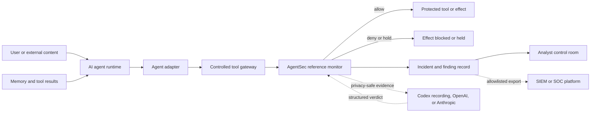
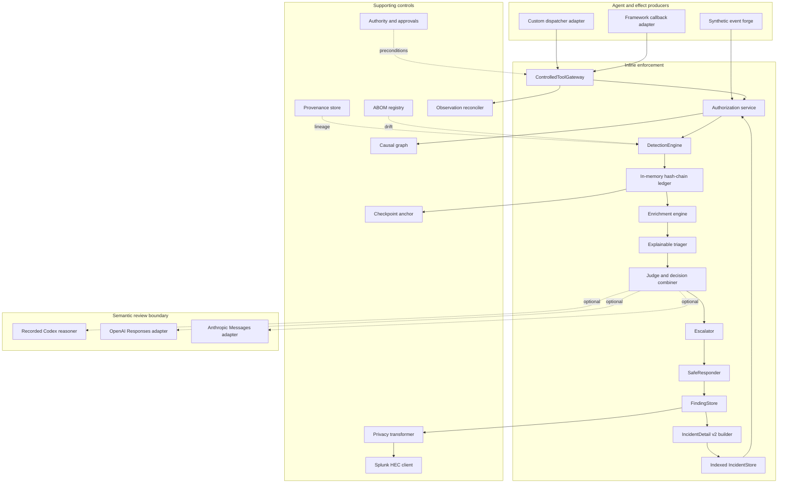
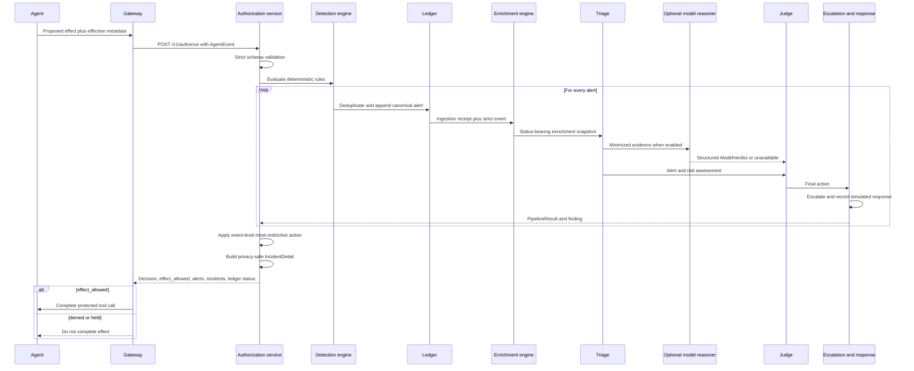
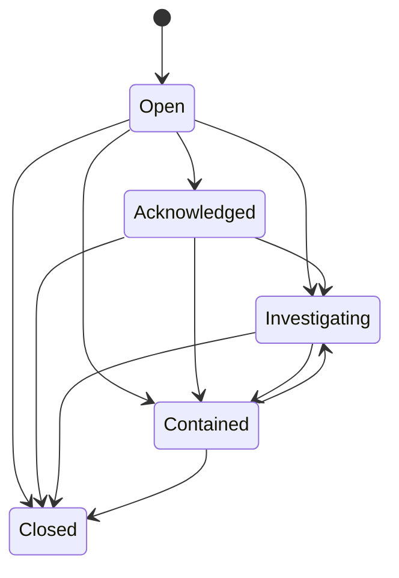
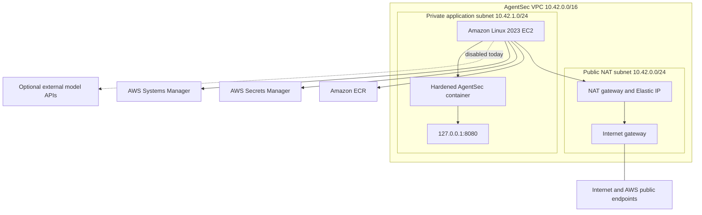
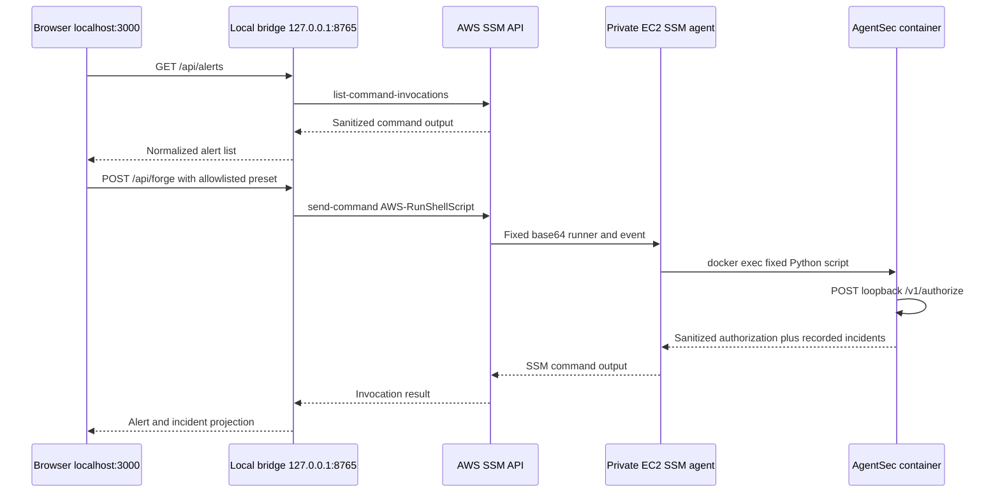
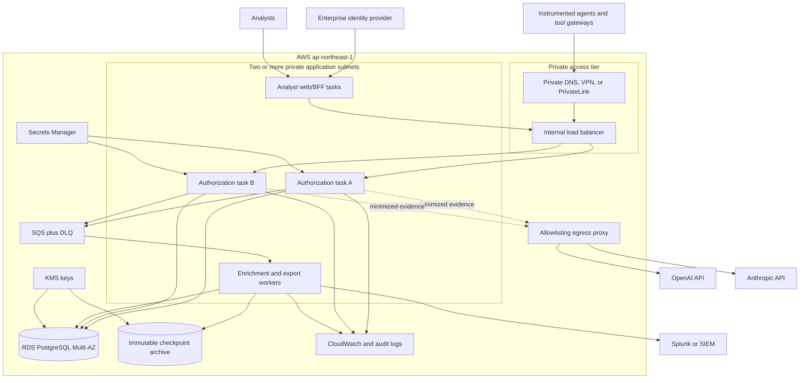

# AgentSec detailed architecture specification

Document status: implemented research PoC plus recommended pilot target  
Architecture version: 2.0
Updated: 2026-07-23
Reference deployment region: AWS Asia Pacific (Tokyo), `ap-northeast-1`

## 1. Purpose

AgentSec is a provider-neutral reference monitor and closed-loop security
operations workflow for AI agents. It evaluates a proposed agent effect before
the effect is completed, applies deterministic security policy, records an
explainable incident, optionally obtains a read-only semantic judgment from an
AI model, and produces an escalation and safe response disposition.

The executable lifecycle is:

```text
Agent event -> Detection -> Ingestion -> Enrichment -> Triage -> Judgment
            -> Escalation -> Response -> Finding and incident detail
```

This document describes:

- the architecture implemented in this repository;
- the local analyst UI and its AWS Systems Manager bridge;
- the historical private single-instance Tokyo deployment design (currently deleted);
- technical and deployment requirements;
- security boundaries and failure behavior;
- a recommended durable, multi-AZ pilot architecture;
- the work required to move from the PoC to that pilot.

It is the canonical architecture document. More focused material remains in the
[threat model](threat-model.md), [data-handling specification](data-handling.md),
[limitations](limitations.md), and
[Tokyo operations runbook](../deploy/ec2-tokyo/OPERATIONS.md).

## 2. Status vocabulary

Every architecture claim uses one of these states:

| State | Meaning |
| --- | --- |
| **Implemented** | Executable source and automated tests exist in this repository. |
| **Deployed PoC** | The capability is present in the approved single-node Tokyo demo. |
| **Deployment-supporting** | Code or infrastructure exists, but the capability is disabled or uses a fake transport. |
| **Target** | Recommended for a pilot or production design; it is not implemented by this repository. |
| **Out of scope** | Deliberately excluded from this release. |

There is currently no AgentSec AWS stack, ECR repository, or running EC2 demo.
The two demo stacks and repository were deleted after the 2026-07-22 POC. The
source now returns privacy-safe authoritative incident details from the exact
pipeline result. Historical records without that contract are explicitly
`summary_only`; the bridge and UI never replay the pipeline or reconstruct a
score. No AWS resource is created or modified by this source optimization.

## 3. Architectural goals and non-goals

### 3.1 Goals

1. Evaluate every protected effect before execution.
2. Keep the deterministic policy path operational without an AI model.
3. Prevent a model from granting authority, approving an action, calling a
   response tool, or weakening a deterministic decision.
4. Preserve provenance and effective authority across agent handoffs.
5. Produce evidence explaining why an alert was generated and how its risk was
   scored.
6. Deduplicate alerts and make ledger mutation detectable.
7. Minimize evidence before it crosses a model, UI, or SIEM boundary.
8. Run the backend without a public IP or inbound security-group rule.
9. Support Codex recorded review now and OpenAI or Anthropic APIs later through
   the same validated verdict contract.
10. Make evaluation reproducible through versioned fixtures, schemas, reports,
    and release gates.

### 3.2 Non-goals of the current PoC

- General semantic proof that an arbitrary prompt caused an effect.
- A complete endpoint, network, identity, or data-loss-prevention product.
- Durable multi-tenant incident storage.
- A production immutable audit ledger or hardware-backed signing service.
- Real containment of hosts, identities, tickets, mail, or cloud resources.
- High availability, autoscaling, backup, or disaster recovery.
- Public dashboard hosting.
- A claim that Tokyo EC2 location controls the processing location of an
  external model provider.

## 4. Design principles and invariants

The following invariants are architectural, not model prompts:

| Invariant | Enforcement mechanism |
| --- | --- |
| Pre-effect enforcement | `ControlledToolGateway` calls `SecurityPipeline` before a mock tool can complete. |
| Authority attenuation | Child grants must be a subset of the parent grant and cannot extend lifetime, depth, or execution count. |
| Most-restrictive decision | `deny > require_approval > allow_with_obligations > allow`. |
| AI cannot weaken policy | Only `semantic_hold` may tighten a decision; weaker model recommendations are rejected. |
| Model failure is non-fatal to policy | Provider failures normalize to deterministic fallback. |
| Untrusted evidence is data | Provider instructions state that evidence is data and model citations must match supplied evidence IDs. |
| Raw content is excluded | Model, incident, UI, and SOC payloads are constructed from allowlists rather than serialized and redacted afterward. |
| Response safety | PoC response actions are records with `simulated=true`; no real response connector is available. |
| Private runtime | EC2 has no public IP, no ingress rules, and publishes the service only on instance loopback. |
| Immutable releases | ECR tags are immutable and service deployment takes an image digest URI. |

## 5. System context


```mermaid
flowchart LR
    U[User or external content] --> A[AI agent runtime]
    M[Memory and tool results] --> A
    A --> AD[Agent adapter]
    AD --> G[Controlled tool gateway]
    G --> RM[AgentSec reference monitor]
    RM -->|allow| T[Protected tool or effect]
    RM -->|deny or hold| B[Effect blocked or held]
    RM --> I[Incident and finding record]
    I --> UI[Analyst control room]
    I -. allowlisted export .-> S[SIEM or SOC platform]
    RM -. privacy-safe evidence .-> P[Codex recording, OpenAI, or Anthropic]
    P -. structured verdict .-> RM
```

The protected tool is inside the enforcement boundary only when invocation is
forced through the gateway or an equivalent independent proxy. An SDK callback
alone is telemetry, not a complete security boundary.

### 5.1 Actors

| Actor | Responsibility | Trust position |
| --- | --- | --- |
| Agent runtime | Proposes an operation and supplies effect metadata. | Untrusted for high-risk authorization. |
| Agent adapter | Normalizes framework-specific proposals into `AgentEvent`. | Parsing boundary; not sufficient proof of effect. |
| Controlled gateway | Makes the authorization call and conditionally invokes the tool. | Required inline enforcement point. |
| Reference monitor | Detects policy violations and returns the final disposition. | Deterministic trusted computing base for the PoC. |
| Semantic reasoner | Reviews minimized evidence and returns a typed verdict. | Outside the authority boundary. |
| Analyst | Investigates, acknowledges, and eventually closes incidents. | Privileged human; target architecture requires authenticated RBAC. |
| AWS operator | Builds, deploys, verifies, and replaces AgentSec-owned resources. | Privileged infrastructure role with change controls. |
| SIEM | Receives an allowlisted finding projection. | External data-processing boundary. |

## 6. Implemented logical architecture


```mermaid
flowchart TB
    subgraph Producers[Agent and effect producers]
      CA[Custom dispatcher adapter]
      FA[Framework callback adapter]
      FG[Synthetic event forge]
    end

    subgraph Enforcement[Inline enforcement]
      GW[ControlledToolGateway]
      API[Authorization service]
      DE[DetectionEngine]
      LE[In-memory hash-chain ledger]
      EN[Enrichment engine]
      TR[Explainable triager]
      JU[Judge and decision combiner]
      ES[Escalator]
      SR[SafeResponder]
      FS[FindingStore]
      ID[IncidentDetail v2 builder]
      IS[Indexed IncidentStore]
    end

    subgraph Supporting[Supporting controls]
      AU[Authority and approvals]
      PR[Provenance store]
      AB[ABOM registry]
      CG[Causal graph]
      CP[Checkpoint anchor]
      OR[Observation reconciler]
      PX[Privacy transformer]
      SP[Splunk HEC client]
    end

    subgraph Models[Semantic review boundary]
      CR[Recorded Codex reasoner]
      OA[OpenAI Responses adapter]
      AN[Anthropic Messages adapter]
    end

    CA --> GW
    FA --> GW
    FG --> API
    GW --> API
    API --> DE --> LE --> EN --> TR --> JU --> ES --> SR
    SR --> FS --> ID --> IS
    JU -. optional .-> CR
    JU -. optional .-> OA
    JU -. optional .-> AN
    FS --> PX --> SP
    AU -. preconditions .-> GW
    PR -. lineage .-> DE
    AB -. drift .-> DE
    IS --> API
    LE --> CP
    API --> CG
    GW --> OR
```

The executable `SecurityPipeline` directly composes detection, ingestion,
enrichment, triage, judgment, escalation, response, finding storage, and the
indexed incident projection. The enrichment engine connects authority,
provenance, ABOM, graph-path, and independent-observation results when trusted
context is supplied; absent optional context is recorded as partial or
unavailable. Checkpoint and Splunk components remain separate reference
controls.

## 7. End-to-end authorization sequence


```mermaid
sequenceDiagram
    participant Agent
    participant Gateway
    participant API as Authorization service
    participant Detect as Detection engine
    participant Ledger
    participant Enrich as Enrichment engine
    participant Triage
    participant Model as Optional model reasoner
    participant Judge
    participant SOC as Escalation and response

    Agent->>Gateway: Proposed effect plus effective metadata
    Gateway->>API: POST /v1/authorize with AgentEvent
    API->>API: Strict schema validation
    API->>Detect: Evaluate deterministic rules
    loop For every alert
      Detect->>Ledger: Deduplicate and append canonical alert
      Ledger->>Enrich: Ingestion receipt plus strict event
      Enrich->>Triage: Status-bearing enrichment snapshot
      Triage->>Model: Minimized evidence when enabled
      Model-->>Judge: Structured ModelVerdict or unavailable
      Triage->>Judge: Alert and risk assessment
      Judge->>SOC: Final action
      SOC->>SOC: Escalate and record simulated response
      SOC-->>API: PipelineResult and finding
    end
    API->>API: Apply event-level most-restrictive action
    API->>API: Build privacy-safe IncidentDetail
    API-->>Gateway: Decision, effect_allowed, alerts, incidents, ledger status
    alt effect_allowed
      Gateway->>Agent: Complete protected tool call
    else denied or held
      Gateway-->>Agent: Do not complete effect
    end
```

Important behavior:

- One event can produce multiple alerts.
- Each alert traverses all seven stages.
- The event action is the maximum action rank across all alert judgments.
- When the event-level action is stricter than an individual alert action, that
  alert's judgment, escalation, response, finding, and timeline are recomputed
  to reflect the event-wide result.
- An event with no detector matches currently defaults to `allow`. Therefore
  detector coverage and an independent gateway are critical assumptions.

## 8. Core component specification

| Component | Source | Inputs | Outputs | State | Status |
| --- | --- | --- | --- | --- | --- |
| Strict contracts | [`contracts.py`](../src/agentsec/contracts.py) | Typed metadata | Pydantic models | None | Implemented |
| Detection engine | [`detection.py`](../src/agentsec/detection.py) | `AgentEvent` | Zero or more `SecurityAlert` objects | Rule list | Implemented |
| Alert ledger | [`ingestion.py`](../src/agentsec/ingestion.py) | `SecurityAlert` | `IngestionReceipt` | Process memory | Implemented |
| Enrichment engine | [`enrichment.py`](../src/agentsec/enrichment.py) | Event plus trusted optional context | Nine-source `EnrichmentSnapshot` | Optional subsystem stores | Implemented |
| Triager | [`workflow.py`](../src/agentsec/workflow.py) | Alert plus enrichment snapshot | Versioned contributions, score, priority, SLA, route | None | Implemented |
| Semantic reasoner | [`reasoning.py`](../src/agentsec/reasoning.py) | Alert and triage | `ModelVerdict` | Recording or provider call record | Implemented/supporting |
| Model registry/router | [`model_registry.py`](../src/agentsec/model_registry.py) | Versioned provider profiles and AI mode | Selected provider-neutral reasoner or explicit failure | Configuration and environment references | Implemented/supporting |
| Judge | [`workflow.py`](../src/agentsec/workflow.py) | Deterministic action and optional model verdict | `Judgment` | Policy version | Implemented |
| Escalator | [`workflow.py`](../src/agentsec/workflow.py) | Alert, triage, judgment | Queue, case ID, escalation level | None | Implemented with synthetic routing |
| Safe responder | [`workflow.py`](../src/agentsec/workflow.py) | Judgment and escalation | `ResponseRecord` | None | Implemented, simulation only |
| Finding store | [`findings.py`](../src/agentsec/findings.py) | Alert and state transition | `Finding` and audit entries | Process memory | Implemented |
| Incident builder | [`incidents.py`](../src/agentsec/incidents.py) | Exact `PipelineResult` | Privacy-safe `IncidentDetail` | None | Implemented in current source |
| Incident store | [`incidents.py`](../src/agentsec/incidents.py) | `IncidentDetail` and lifecycle updates | Indexed detail, summaries, timeline | Process memory | Implemented |
| Case service | [`cases.py`](../src/agentsec/cases.py) | Pipeline findings, correlated incident IDs, authenticated analyst mutations | Durable case detail, teams, SLA health, collaboration, review, hash-chain audit | Tenant-scoped SQLite WAL/full-sync | Implemented product module |
| Pipeline orchestrator | [`pipeline.py`](../src/agentsec/pipeline.py) | `AgentEvent` | `EventProcessingResult` | Composed in-memory stores | Implemented |
| HTTP service | [`service.py`](../src/agentsec/service.py) | Authenticated JSON | `AuthorizationResponse` | One pipeline per process | Implemented |
| Authority service | [`authority.py`](../src/agentsec/authority.py) | Signed grants | Effective grant or error | Use counters in memory | Implemented reference |
| Approval service | [`approval.py`](../src/agentsec/approval.py) | Bound approval token and event | Single-use approval decision | Nonces in memory | Implemented reference |
| Provenance store | [`provenance.py`](../src/agentsec/provenance.py) | Source/tool/handoff/memory lineage | Conservative trust class | Process memory | Implemented reference |
| ABOM registry | [`abom.py`](../src/agentsec/abom.py) | Signed manifest and runtime observation | `AbomDiff` | Process memory | Implemented reference |
| AI security graph | [`graph.py`](../src/agentsec/graph.py) | Inventory topology and event processing results | Temporal snapshots, reachability, blast radius, weighted attack paths | Tenant-scoped durable SQLite reference adapter | Implemented product module |
| Checkpoint anchor | [`checkpoints.py`](../src/agentsec/checkpoints.py) | Ledger head | Signed checkpoint and verification | Process memory | Implemented reference |
| Effect observer | [`observation.py`](../src/agentsec/observation.py) | SDK and gateway reports | Telemetry inconsistency findings | None | Implemented reference |
| Privacy transformer | [`privacy.py`](../src/agentsec/privacy.py) | Alert/result metadata | Model and SOC allowlist projections | None | Implemented |
| External API and SIEM plane | [`integrations.py`](../src/agentsec/integrations.py) | Allowlisted `SocFindingExport`, scoped client requests, destination policy | Digest-bound stream, delivery/ack receipts, dead letters, public resource API | Tenant-scoped SQLite outbox/audit; runtime credentials | Implemented single-node reference; vendor destinations disabled |

These 24 components form the bounded research-PoC module catalog. Their
implementation evidence, automated verification evidence, limitations, and
next maturity boundary are maintained in
[`module-maturity-matrix.md`](module-maturity-matrix.md) and checked by
`make module-audit`. A verified PoC module is not a claim of pilot or production
readiness.

## 9. Input and contract architecture

### 9.1 AgentEvent

`AgentEvent` is a metadata-only statement about a proposed effect. Its JSON
Schema is committed as
[`action-event.schema.json`](../schemas/generated/action-event.schema.json).

Required semantic groups are:

| Group | Fields | Purpose |
| --- | --- | --- |
| Identity | `tenant_id`, `flow_id`, `agent_id`, `event_id` | Scope and correlate the operation. |
| Effect | `operation`, `resource`, `destination`, `is_effectful` | Describe what would happen. |
| Provenance | `source_type`, `source_id`, `source_trust` | Record where influence originated. |
| Classification | `data_classes` | Identify secret or otherwise governed data. |
| Authority | `authority_operations`, `approval_present` | Declare effective operations and approval state. |
| Tool contract | `tool_name`, declared and observed schema digests | Detect MCP or tool drift. |
| Detection hints | `indicators` | Carry normalized evidence such as memory poisoning. |
| Extension metadata | `attributes` | Strict string map; prohibited from model, incident, and SOC output. |

Pydantic models use `extra="forbid"`, stripped strings, bounded field sizes, and
timezone-aware event timestamps. A request that does not satisfy the contract
returns `400 invalid_request` from the HTTP service.

### 9.2 Core output contracts

| Contract | Version | Description |
| --- | --- | --- |
| `AuthorizationResponse` | 2.0.0 | Overall action, effect flag, alert summaries, incident details, and ledger status. |
| `SecurityAlert` | 1.0.0 | Detector result and deterministic recommendation. |
| `PipelineResult` | Generated schema | Exact record across all seven workflow stages for one alert. |
| `IncidentDetail` | 2.0.0 | Allowlisted authoritative explanation or honest `summary_only` history. |
| `EnrichmentSnapshot` | Generated schema | Status-bearing facts, evidence references, latency, triage effect, and failure effect. |
| `TriageAssessment` | Generated schema | Reproducible contributions, priority, SLA, route, warnings, and narrative. |
| `ModelVerdict` | Generated schema | Provider-neutral structured semantic recommendation. |
| `Finding` | 1.0.0 | Deduplicated analyst case with immutable audit transitions. |
| `SocFindingExport` | 1.0.0 | Minimized SIEM projection. |

All generated schemas live in [`schemas/generated`](../schemas/generated/) and
are regenerated or verified with `make schemas` and `make check-schemas`.

## 10. Detection architecture

The engine runs all rules and may emit more than one alert for an event.

| Detector | Match condition | Severity | Confidence | Deterministic recommendation |
| --- | --- | ---: | ---: | --- |
| `DET-INDIRECT-INJECTION-001` | Untrusted/adversarial source plus `indirect_prompt_injection` indicator | High | 0.94 | Deny |
| `DET-SECRET-EGRESS-001` | `external.send` or `external.upload` with `secret` data class | Critical | 0.99 | Deny |
| `DET-AUTHORITY-001` | Effectful operation absent from effective authority operations | High | 1.00 | Deny |
| `DET-MEMORY-POISONING-001` | Memory source, `memory_poisoning` indicator, and effectful event | High | 0.96 | Deny |
| `DET-MCP-DRIFT-001` | Declared and observed tool schema digests differ | High | 1.00 | Require approval |
| `DET-DESTRUCTIVE-APPROVAL-001` | Delete, isolate, or revoke without approval | High | 1.00 | Require approval |

Alert identity is deterministic for the tuple:

```text
tenant_id | agent_id | alert_type | resource | flow_id
```

The SHA-256 digest of that tuple is used as the fingerprint. The alert ID and
finding ID use stable prefixes plus the first 32 hexadecimal characters. This
enables idempotent duplicate behavior within one running process.

## 11. Ingestion and integrity architecture

The PoC ledger stores canonical alert objects in order and creates each receipt
as:

```text
current_hash = SHA256(canonical_alert_bytes || previous_hash || sequence)
```

Properties:

- sequence starts at 1;
- the genesis hash is 64 zeroes;
- duplicate fingerprints return their original receipt with `duplicate=true`;
- mutation, removal, insertion, or reordering is detected at verification;
- a separate PoC checkpoint anchor signs a sequence and ledger head.

Limitations:

- the ledger and checkpoint anchor are both in process memory;
- the HMAC signer is a reference implementation, not KMS/HSM custody;
- process restart loses the ledger;
- `ledger_verified=false` is reported but the minimal HTTP service does not yet
  turn it into a separate platform-wide circuit breaker.

The target design persists canonical records transactionally, writes signed
checkpoint heads to a separate immutable store, and pages on any integrity
failure.

## 12. Enrichment and explainable triage architecture

### 12.1 Authoritative enrichment snapshot

Enrichment runs after the ledger receipt and before triage. It receives the
strict event plus an optional trusted EnrichmentContext; the browser cannot
supply this context. Each source returns:

- status: complete, partial, unavailable, or failed;
- observed_at, status-derived confidence, and measured latency_ms;
- metadata-only facts;
- hashed or opaque evidence_refs;
- affects_triage;
- failure_effect, fixed to state that missing context cannot relax
  deterministic enforcement.

The nine ordered sources are:

| Source | Connected control | Complete when | Triage signal |
| --- | --- | --- | --- |
| provenance | ProvenanceStore plus event trust | lineage IDs resolve | untrusted/unknown trust or cross-session memory |
| effective_authority | AuthorityService plus grant | signed grant is supplied and checked | operation or full scope is outside the grant |
| data_classification | strict event metadata | always for a valid event | secret/restricted/credential classification |
| destination_classification | normalized destination metadata | always for a valid event | external network destination |
| abom_tool_drift | AbomRegistry or event schema digests | manifest or sufficient digests exist | tool/schema/operation/destination drift |
| agent_model_profile | trusted owner/profile/asset context | all profile facts are supplied | model-profile mismatch or critical asset |
| independent_observations | ObservationReconciler | SDK/gateway observations are supplied | observed effect disagreement |
| causal_path | recorded CausalPath | trusted path is supplied | investigation context; no implicit authorization |
| repeat_frequency | ledger duplicate receipt plus pipeline flow/type counter | always | duplicate fingerprint or repeated same-type finding in one flow |

Unexpected source exceptions are converted into a failed result. Four sources
are mandatory for the snapshot completeness signal: provenance, effective
authority, data classification, and destination classification. A mandatory
failure adds risk; no enrichment failure changes the deterministic detector
recommendation to a weaker action.

### 12.1.1 Governed live connector runtime

Module 13 retains those nine deterministic built-ins and adds a bounded
connector SDK for live inventory, reputation, identity, vulnerability, and
other metadata services. A connector registers an immutable name/version,
required input fields, allowed output fact keys, deadline, fresh TTL, maximum
stale horizon, and mandatory-context flag. Callable adapters support native
clients; the production-facing JSON adapter requires an exact credential-free
HTTPS URL, refuses redirects, uses the platform TLS verifier, caps responses at
1 MiB, and validates the same strict payload contract.

The engine runs connector calls concurrently in a bounded worker pool. Each
connector has its own absolute deadline, so one slow service does not serialize
or indefinitely hold the rest. `collect_async` provides an awaitable facade for
async applications while the synchronous authorization pipeline uses the same
bounded execution semantics. Timed-out work cannot change a later pipeline
decision.

Connector access is tenant scoped and requires separate read, execute, and
admin permissions. Runtime policy explicitly names allowed connectors and
input fields. The request builder contains only selected metadata: hashed
event/flow/agent/source/resource/destination/tool references plus bounded
classifications such as operation, resource class, trust, and data classes.
Raw prompt content, tool arguments/results, raw resource/destination values,
headers, and credentials are not connector inputs. Required fields denied by
policy produce a visible `policy_denied` source result rather than implicit
fallback. Output facts and hashed evidence references are separately
allowlisted, schema validated, and size bounded.

The configured SQLite WAL/full-sync store retains only a hashed input cache
key, validated metadata response, freshness timestamps, and per-connector
health counters. A fresh match avoids a network call. After expiry, a failed or
timed-out refresh may return the prior response only until its explicit maximum
stale horizon; that response becomes `partial`, is labeled `stale`, records its
age, and increments stale-fallback health. It never masquerades as fresh.

Consecutive failures open a durable circuit for a configured cooldown. While
open, the engine uses an eligible labeled stale entry or returns unavailable;
it does not repeatedly call the source. A successful half-open call after the
cooldown closes the circuit. Authenticated `GET /v1/enrichment/health` exposes
success/failure/timeout/cache/stale counters, last outcome/latency, cache entry
counts, and current circuit state without returning requests, secrets, or raw
identifiers. Every snapshot additionally records connector count, cache/stale/
timeout counts, per-source cache/freshness/policy evidence, and a SHA-256 digest
of the effective connector policy.

Local assembly requires both `AGENTSEC_ENRICHMENT_DB` and
`AGENTSEC_ENRICHMENT_CONFIG`. The bounded JSON configuration stores endpoint
and environment-variable *names* only; bearer values are read from the named
environment variables and are never serialized into requests, cache state,
health, or snapshots. The tenant is explicit or inherited from another product
store and must align with every configured module.

### 12.2 Versioned contribution model

Triage version triage-2026-07-23.2 starts with the detector severity base and
adds evidence-linked contributions:

| Contribution | Delta |
| --- | ---: |
| Severity base: info / low / medium / high / critical | 10 / 25 / 50 / 75 / 95 |
| Detector confidence at least 0.95 | +3 |
| Untrusted, suspected-adversarial, or unknown provenance | +2 |
| Persistent/cross-session memory influence | +5 |
| Sensitive data involved | +10 |
| External destination | +5 |
| Requested authority exceeds effective grant | +10 |
| Destructive/containment operation | +8 |
| Tool or ABOM drift | +8 |
| Model-profile drift | +5 |
| High/critical asset | +5 |
| Repeated same-flow alert | +5 |
| SDK/gateway observation disagreement | +10 |
| Mandatory enrichment unavailable or failed | +5 |
| Score ceiling | negative delta required to make the sum exactly 100 |

Every contribution has a category, label, signed delta, at least one evidence
reference, and rationale. The IncidentDetail validator rejects a complete
record unless the contribution sum equals the stored risk score. The score
cannot change deterministic authorization; it drives priority, SLA, and analyst
routing.

| Final score | Priority | SLA | Route |
| --- | --- | ---: | --- |
| 90-100 | P0 | 15 minutes | soc-critical |
| 70-89 | P1 | 60 minutes | soc-urgent |
| 40-69 | P2 | 240 minutes | soc-review |
| 0-39 | P3 | 1,440 minutes | security-observation |

The recorded assessment also contains source warnings and a concise narrative.
The UI renders these values; it does not independently calculate a score,
priority, SLA, route, or explanation.

## 13. Judgment and model architecture

### 13.1 Decision combiner

The action order is fixed:

```text
deny > require_approval > allow_with_obligations > allow
```

Critical alerts fail closed to `deny`. For every other result, deterministic
policy remains the initial decision. A model verdict can only influence the
final action in `semantic_hold` mode, and only when it is more restrictive.

### 13.2 AI modes

| Mode | Model called | Can affect final action | Behavior |
| --- | --- | --- | --- |
| `off` | No | No | Fully deterministic. |
| `shadow` | Yes | No | Record and compare the verdict. |
| `advisory` | Yes | No | Show an analyst recommendation. |
| `semantic_hold` | Yes | Tighten only | May add a hold or denial; cannot weaken policy. |

### 13.3 Provider-neutral boundary

`SecurityReasoner.analyze(alert, triage)` returns one locally validated
`ModelVerdict` containing provider, exact model ID, action, confidence, evidence
IDs, reason codes, and uncertainty.

Implemented reasoners:

- `RecordedCodexReasoner`: versioned offline verdicts used by the current demo;
- `OpenAIResponsesReasoner`: live-capable adapter, disabled by profile;
- `AnthropicMessagesReasoner`: live-capable adapter, disabled by profile.

Live provider adapters:

- receive `ModelEvidenceBundle`, not the raw event;
- accept only HTTPS endpoints with exact host and path allowlists;
- use schema-constrained output;
- validate JSON locally with Pydantic;
- reject evidence IDs that were not supplied;
- reject unexpected model IDs;
- normalize timeout, refusal, malformed JSON, and schema failure to
  `ModelUnavailableError`;
- record request ID, model ID, token usage, latency, and output digest without
  storing the API key.

The OpenAI request sets `store=false`. Live deployment still requires provider
privacy, retention, residency, and contractual approval. The text “Tokyo” in a
profile name describes the EC2 caller location, not provider processing
residency.

### 13.4 Model failure behavior

| Failure | Current behavior | Required pilot behavior |
| --- | --- | --- |
| Provider timeout or network error | Deterministic fallback; timeline records model unavailable. | Same, plus metric and alert after threshold. |
| Refusal or truncated response | Deterministic fallback. | Same. |
| Invalid structured output | Deterministic fallback. | Same, retain only safe validation metadata. |
| Unknown evidence citation | Reject verdict and fall back. | Same. |
| Model suggests weaker action | Record `MODEL_RELAXATION_REJECTED`. | Same; invariant test required at release. |
| Model unavailable in semantic hold | Deterministic action continues. | Policy owner must explicitly approve this availability/safety tradeoff. |

### 13.5 Bounded five-role AI analyst

Module 14 runs after deterministic judgment, escalation, and response have
already been recorded. It therefore cannot sit in the effect-authority path.
For each alert, `AiAnalystService` executes exactly five ordered roles:

1. triage assesses urgency, confidence, missing context, and routing;
2. investigation forms and challenges a bounded security hypothesis;
3. judge proposes a non-executive action;
4. escalation advises human routing and urgency; and
5. response advisor proposes safe, reversible options without executing them.

Each role receives a purpose-specific result from the read-only
`evidence.query` tool. The manifest is built from a strict allowlist over the
recorded alert, detector evidence, enrichment facts/freshness, triage
contributions, ledger receipt, deterministic judgment, escalation, and response.
Raw event attributes, prompt/model text, memory, tool arguments/results,
credentials, raw identifiers, and ungoverned evidence are excluded. Every tool
call has a digest-bound receipt. A role result is accepted only when its role,
provider, model ID, schema, and all citations match the governed request.

Completed roles must supply a summary, confidence, cited evidence, at least one
alternative, and explicit uncertainty. A role may abstain; timeout, malformed
output, identity mismatch, or fabricated citations become `unavailable`.
Neither state is silently converted into a conclusion. The run records
cross-role conflicts, judge-versus-policy tightening or rejected relaxation,
abstention, unavailability, and whether human review is required.

The deterministic action remains authoritative. `advisory_action` is the more
restrictive of deterministic policy and an accepted judge proposal;
`executive_authority` is structurally fixed to false. The role engine can never
grant authority, create approval, execute containment, suppress an alert, or
weaken the recorded action. An engine outage leaves the completed deterministic
pipeline unchanged.

Runs and feedback are tenant-scoped SQLite WAL/full-sync records with canonical
SHA-256 integrity checks, idempotency by alert, bounded pagination, exact
read/run/feedback permissions, and aggregate health. Feedback is recursively
redacted and structurally marked `applied_to_model=false`; Module 23 owns any
future evaluated learning loop. The checked-in
`configs/codex-analyst-evaluation.json` is a reproducible recorded Codex test,
not a live API call. Provider routing, qualification, budgets, privacy routing,
and secret lifecycle are implemented by Module 15.

### 13.6 Governed live model gateway

ModelGatewayService is the only supported live-provider control plane. It
stores immutable prompt and route revisions, secret fingerprints (never secret
values), exact-model qualification evidence with bounded expiry, lifecycle
history, provider health/circuit state, transactional budgets, sanitized call
receipts, and hash-only audit entries in a tenant-scoped SQLite WAL database.

A route becomes selectable only after candidate → passed qualification → shadow
→ active. Qualification binds route digest, prompt digest, exact returned model
ID, evaluation-suite version, evidence digest, executor/reviewer separation, and
expiry. Activation independently verifies review separation and current secret
fingerprint. Rollback can restore only a current qualified prior revision.

Routing evaluates workload, AI mode, and data-classification subset before any
provider object is constructed. Secret egress and secret/credential/PII markers
force restricted classification. A fallback is never a bypass: it must be
independently active, qualified, privacy-compatible, budget-available, and
healthy.

Request/minute, tokens/day, and concurrency reservations occur atomically.
Failure opens a per-route circuit after the configured threshold and stores only
a normalized error code. The call ledger binds model, prompt, route, mode,
privacy, usage, latency, provider request ID, and output digest; it excludes raw
evidence, prompt/output content, headers, tokens, and credentials.

Live OpenAI and Anthropic adapters implement both the legacy security verdict
and Module 14 role protocol. Responses are accepted only after exact model,
strict local schema, evidence-citation, role, and non-relaxation validation.
Provider unavailability leaves deterministic enforcement unchanged.

### 13.7 Model gateway and AI governance

Module 15 replaces static provider readiness with a tenant-scoped model control
plane. Its durable objects are immutable prompt versions, environment-backed
secret-version metadata, immutable route revisions, time-bounded qualification
records, provider-health/circuit state, route lifecycle history, sanitized call
receipts, and audit digests. Raw prompts, role payloads, model output, and secret
values are deliberately absent from that database.

The selection sequence is fail closed:

```text
workload + AI mode + data classes
  -> active route
  -> exact route/prompt/model qualification (unexpired)
  -> closed circuit
  -> active matching secret fingerprint
  -> atomic request/token/concurrency reservation
  -> exact provider adapter
  -> local schema/identity/citation/action validation
  -> sanitized completion or failure receipt
  -> configured fallback, if eligible
```

Known workloads are `security_verdict` and `analyst_role`; each prompt must bind
the locally computed output-schema digest. Routes bind an exact official HTTPS
endpoint, exact model ID, prompt and secret version, privacy classes, AI modes,
region label, priority/fallback, and bounded request, token, concurrency, output,
and timeout policy. Secret/credential/PII findings are classified `restricted`
before route selection. Privacy incompatibility therefore occurs before provider
construction or credential resolution.

Route release is candidate → shadow → active → retired. Qualification requires
strict evidence metrics and a reviewer distinct from the executing actor;
activation requires separation from that reviewer. Qualifications expire after
one to 720 hours. Rollback can restore only a prior retired revision whose exact
qualification remains current and whose secret fingerprint resolves. Failed
calls consume their conservative token reservation, preventing failure-based
budget evasion. Repeated failures open the per-route circuit and permit only an
independently eligible fallback.

The service exposes authenticated registry, health, call, audit, and lifecycle
APIs. The loopback bridge exposes only a fixed read aggregate, and the UI renders
authoritative route, qualification, budget, circuit, prompt, and call evidence
with explicit empty/offline states. The example configuration creates candidate
definitions only. Automated tests use fake transports; no real provider/model
qualification is claimed.

### 13.8 Evidence validation and human judgment gates

Module 16 adds a deterministic boundary between schema-valid model output and a
supported security conclusion. Every completed role emits typed claims over an
allowlisted evidence fact. The validator checks the declared operator against
the exact cited manifest item, enforces role-specific mandatory evidence,
records matched/conflicting sources, detects mutually exclusive equality claims,
screens instruction-like model/evidence data, and caps confidence from recorded
support quality.

The resulting `JudgmentValidationReport` is bound to the deterministic action,
fixes automation eligibility to false, carries explicit human-gate reasons, and
is digest-verified with the containing analyst run. It is exposed through the
same analyst and incident contracts; the UI does not synthesize support.

The earlier single-verdict path receives a smaller validation before semantic
tightening. Unknown evidence, relaxation, instruction content, or confidence
above the evidence ceiling prevents automatic tightening and preserves the
deterministic hold for human review. This is consistency validation over typed
metadata—not proof that an upstream source or model assertion is true.

## 14. Escalation, response, and findings

### 14.1 Escalation matrix

| Condition | Level | Queue | Case behavior |
| --- | --- | --- | --- |
| P0 and deny | `incident_page` | `soc-critical` | Synthetic case ID created. |
| Any other deny | `soc_urgent` | `soc-urgent` | Synthetic case ID created. |
| Require approval | `review_queue` | `security-approval` | Synthetic case ID created. |
| Allow | `none` | None | No case. |

### 14.2 Safe response

PoC response actions are one or more of:

- `record_only`;
- `hold_for_approval`;
- `block_effect`;
- `quarantine_session`.

They are always marked `simulated=true`. A denied event is prevented at the
mock gateway and its finding transitions to `contained`. There is no production
EDR, IAM, ticketing, mail, or orchestration connector.

### 14.3 Finding lifecycle


```mermaid
stateDiagram-v2
    [*] --> Open
    Open --> Acknowledged
    Open --> Investigating
    Open --> Contained
    Open --> Closed
    Acknowledged --> Investigating
    Acknowledged --> Contained
    Acknowledged --> Closed
    Investigating --> Contained
    Investigating --> Closed
    Contained --> Investigating
    Contained --> Closed
```

Every transition appends an actor, reason, source status, target status, and
timestamp. Closed is terminal in the current model.

## 15. Incident-detail architecture

The current source builds the analyst record directly from the exact
`PipelineResult` that produced the authoritative action. It does not run the
event through a second pipeline.

`IncidentDetail` 2.0.0 contains:

- event context with hashed source/resource/destination references;
- alert identity, detector, confidence, reason codes, and hashed evidence;
- ledger sequence and chain hashes;
- triage score, priority, reasons, and reproducible contributions;
- the exact nine-source enrichment snapshot and explicit source failures;
- deterministic, model, and final judgments;
- escalation routing and case ID;
- response actions and whether the effect was allowed;
- finding status and audit history;
- the ordered seven-stage timeline;
- validation assertions;
- redaction-policy version and reference count.

The validation status means “confirmed policy violation in the evaluated agent
event.” It does not claim that a synthetic event proves a real-world compromise.
The complete contract is
[`incident-detail.schema.json`](../schemas/generated/incident-detail.schema.json).

Complete records must contain every required section. The Pydantic validator
rejects partial records labeled complete, mismatched finding/alert identifiers,
out-of-order stages, mismatched contribution copies, and non-reproducible scores.
The in-memory `IncidentStore` is keyed by finding ID and maintains secondary
indexes for event ID, flow ID, alert type, agent ID, severity, priority, status,
and creation time. It stores only the post-response record and updates finding
status/audit atomically under the service process lock.

### 15.1 Detail availability

| UI label | Source | Assurance |
| --- | --- | --- |
| `complete` / `AUTHORITATIVE PIPELINE RESULT` | Incident recorded from the exact `PipelineResult` after response/finding update. | Highest available PoC assurance. |
| `summary_only` / `HISTORICAL SUMMARY ONLY` | Sanitized summary that predates or lacks IncidentDetail 2.0.0. | No enrichment, score, timeline, judgment, or response evidence is synthesized. |

## 16. Supporting security controls

### 16.1 Authority grants

Authority grants bind issuer, subject, tenant, environment, operations,
resources, destinations, data classes, validity window, delegation depth, and
execution limit. Delegation rejects any child scope not contained by the parent.
Scope wildcards are limited to exact strings or a trailing `*`.

Current signing uses `PocHmacSigner`. Target deployment uses asymmetric or KMS
signing, rotation, revocation, and durable execution counters.

### 16.2 Exact approvals

Approval tokens bind to the canonical event and policy version, have a validity
window, and are single use. An approval satisfies a required human decision; it
does not grant an operation that is outside effective authority.

### 16.3 Provenance

The provenance store propagates the most conservative trust class across source,
tool result, transformation, handoff, and memory references. A target system
must make provenance mandatory at every framework and tool boundary rather than
accepting it only from the agent.

### 16.4 Agent Bill of Materials

The signed ABOM manifest describes agent/build/instruction digests, model
profiles, tools, allowed data classes, destinations, and policy bundle. Runtime
observations identify unknown agents, unknown tools, changed schemas, new
operations, new destinations, and new data classes.

### 16.5 Causal graph

The metadata graph records source-to-agent, agent-to-resource,
resource-to-destination, destination-to-decision, and decision-to-finding edges.
It reconstructs paths within a flow. It is an investigation aid, not an inline
blocker in the current PoC.

### 16.6 Independent effect observation

The observer compares agent SDK phases with gateway observations and detects:

- a gateway completion missing from SDK telemetry;
- an SDK completion missing from gateway telemetry;
- SDK effect activity with no gateway observation.

Production needs an observation source independent of the protected agent, such
as an egress proxy, tool broker, cloud audit log, or network sensor.

### 16.7 SOC export

`PrivacyTransformer.soc_export` creates a new `SocFindingExport` from an
allowlist. The Splunk client requires HTTPS, an allowlisted hostname, and the
exact `/services/collector/event` path. Delivery is idempotent by finding ID;
failures create a safe dead letter. Production must persist and encrypt dead
letters and use indexer acknowledgment before calling delivery durable.

## 17. Data architecture

### 17.1 Classification

| Data class | Examples | Current handling | Target handling |
| --- | --- | --- | --- |
| Prohibited raw content | Prompts, model text, tool arguments/results, memory content, credentials | Must not enter model, incident, UI, or SIEM contracts. | Reject at ingress where possible; DLP/canary enforcement. |
| Restricted metadata | Tenant, agent, operation, resource/destination references, reason codes | In memory; minimized or hashed across boundaries. | Encrypted transactional storage with tenant isolation. |
| Security evidence | Alerts, judgments, timelines, finding audit, ledger hashes | In memory and sanitized response. | Encrypted database plus immutable checkpoint archive. |
| Secrets | Ingest token, provider keys, HEC token | Environment from Secrets Manager on EC2. | Secrets Manager with rotation and narrowly scoped task roles. |
| Release evidence | Schemas, synthetic reports, digests | Committed, non-secret artifacts. | Signed CI artifacts with retention policy. |

### 17.2 Current storage

| Store | Persistence | Contents |
| --- | --- | --- |
| Pipeline process memory | Until restart | Ledger, findings, authority counters, approvals, provenance, ABOM observations, graph, checkpoints. |
| Module 2 intake SQLite | Durable local transaction/WAL | Signed-request nonces, safe telemetry envelopes, idempotency, queue leases, retry/DLQ, source health. |
| Module 4 canonical SQLite | Durable local transaction/WAL | Versioned canonical records, per-tenant hash chains, ciphertext evidence, signed checkpoints, retention tombstones, and backup metadata. |
| Module 5 search SQLite | Durable local derived index | Allowlisted canonical projections, typed search fields, signed cursors, saved hunts, and tenant-bound audit metadata. It contains no protected evidence blob content. |
| Module 6 inventory SQLite | Durable local transaction/WAL | Discovered and declared AI applications, agents, models, tools, data stores, relationships, effective permissions, configuration revisions, governance, risk rollups, and audit metadata. |
| Local bridge memory | Until restart | Recently forged rich alerts and a short polling cache. |
| SSM command history | AWS-managed temporary history when a demo is deployed | Sanitized remote command output; not a current data source or durable store. |
| Repository reports | Durable in source tree | Synthetic evaluation and deployment evidence with no secret values. |

### 17.3 Recommended pilot persistence

Use PostgreSQL as the system of record to avoid split-brain transactions across
alerts, judgments, findings, audit entries, and an export outbox.

Recommended logical tables:

- `events`: unique tenant/event ID, metadata projection, received timestamp;
- `alerts`: fingerprint uniqueness, detector result, event foreign key;
- `ledger_entries`: monotonic producer sequence, canonical digest, previous hash;
- `triage_assessments`: score, priority, score-policy version;
- `judgments`: deterministic, model, and final actions;
- `model_calls`: provider metadata and output digest, never API keys/raw prompts;
- `escalations`: queue, external case reference, lifecycle state;
- `responses`: requested and completed response actions;
- `findings`: tenant-scoped incident aggregate;
- `finding_audit`: append-only state transitions;
- `incident_details`: versioned analyst projection or reproducible materialized view;
- `outbox`: transactional SIEM/notification messages;
- `approval_nonces`: single-use approval state;
- `authority_usage`: grant counters and revocation state;
- `abom_manifests` and `abom_observations`;
- `ledger_checkpoints`: KMS-signed heads and immutable archive reference.

Tenant ID must be present in every primary/unique key and every authorization
query. PostgreSQL row-level security is recommended as defense in depth, not as
the only tenant check.

### 17.4 Retention targets

Module 4 implements a versioned local reference retention engine, legal holds,
payload/ciphertext erasure, and auditable tombstones. Production durations must
still be approved by legal, privacy, and security owners. A reasonable starting
proposal is:

| Record | Hot retention | Archive retention | Notes |
| --- | ---: | ---: | --- |
| Authorization decisions | 30 days | 365 days | Metadata only. |
| Findings and audit | 365 days | Policy-dependent | Preserve closure evidence. |
| Provider call metadata | 30 days | 90 days | No raw prompts or provider credentials. |
| SSM command output | Minimize | None for normal data plane | SSM is not a production event store. |
| Synthetic evaluation reports | Repository lifetime | Release archive | Non-sensitive fixtures only. |

### 17.5 Temporal AI security graph

The Module 7 reference adapter stores graph nodes and edges as temporal
revisions keyed by tenant, entity identity, version, `valid_from`, and
`valid_to`. Current-version uniqueness prevents competing heads. Each revision
has a canonical SHA-256 digest, source reference, and audit entry. Chronological
updates close the prior interval; late or conflicting same-time mutations fail
closed instead of rewriting history.

Inventory applications, agents, pinned models, tools, data stores, and their
contains/uses/accesses relationships seed the entity topology. Every live
authorization adds privacy-safe source, agent, resource, destination, decision,
and finding nodes plus influence, call, authorization, send, and evidence
relationships. A blocked effect remains visible as a potential path through its
decision node; the restrictive decision adds path cost and reason codes rather
than being incorrectly drawn after the destination.

All traversal is bounded. Reachability has direction, depth, and node limits;
blast radius is derived from bounded downstream reachability; weighted attack
paths use a priority queue, reject cycles, limit depth/path count/explored
states, and return explicit truncation. Historical analysis evaluates the graph
at one timezone-aware timestamp. Label keys are allowlisted metadata and reject
prompt-, content-, argument-, result-, token-, secret-, password-, credential-,
authorization-, and API-key-shaped fields.

### 17.6 AI security posture state

Module 8 evaluates the current tenant inventory through immutable versioned
posture checks. The local adapter persists check definitions and digests,
deduplicated findings, accepted-risk records, scan results, and audit events in
one SQLite database using WAL and full synchronization. Search, inventory,
graph, and posture principals must agree on tenant identity before application
startup.

Each finding is deterministically keyed by tenant, check, and component. It
retains the exact check version, safe observed values, inventory and
configuration-digest evidence references, calculated risk, remediation steps,
framework mappings, and first/last/resolved times. Re-scans update current
facts and resolve corrected or retired components without deleting history.
Posture score is the rounded percentage of passing applicable evaluations;
trend records preserve both results and current open/accepted counts.

An accepted-risk record never changes the check result. It changes the finding
workflow state for a maximum of 366 days, requires reason/owner/approver, is
unique while active, expires automatically, and can be explicitly revoked.
Expiry or revocation reopens a still-unresolved finding. All scans, queries,
pages, strings, and exception windows are bounded, and all writes are atomic.

### 17.7 Versioned detection runtime

Module 9 defines detection rules as strict data contracts rather than
executable source. Definitions contain a fixed rule kind, execution mode,
allowlisted metadata predicates, bounded grouping/window parameters, alert
contract, evidence fields, and OWASP/MITRE/NIST mappings. Canonical SHA-256
digests and natural version ordering make versions immutable and auditable.
The six original controls are expressed declaratively; the legacy Python rule
protocol remains only as a compatibility extension boundary.

The local adapter stores rule history, sanitized events, execution audit, and
health inputs transactionally in SQLite. Before storage, the arbitrary event
attributes map is replaced with an empty map. Tenant/time indexes support a
maximum 10,000-event window; an observed-event-time watermark prunes records
outside the seven-day maximum rule horizon and a hard count cap prevents
unbounded historical or stale-timestamp input.

Event rules evaluate one record. Sequence rules reconstruct ordered distinct
events; threshold rules count matching events in a fixed group/window;
correlation rules assign distinct events to unordered predicates. Streaming
evaluation anchors a match to the current event. Scheduled evaluation replays
the durable window at a timezone-aware timestamp. Semantic rules have a fixed
prefilter/profile/confidence contract and accept only a normalized verdict that
cites known event references. Provider failure becomes one sanitized rule
error while deterministic rules continue.

### 17.8 Signed detection-content control plane

Module 10 places a separate lifecycle store in front of the Module 9 live rule
registry. A rule is append-only signed content with author, status, timestamps,
review identity/comment, definition, deterministic validation, backtest, shadow
result, record digest, and signature. The local adapter uses SQLite WAL/full
synchronization and a separately configured HMAC key. Reads recompute canonical
SHA-256 and verify the signature before returning a record.

The release state machine is `draft -> in_review -> approved -> shadow ->
published`; rejection returns content to an editable path and publication
retires the prior published record. Every edit creates a revision and clears
all derived evidence. Submission requires a passing exact-outcome suite for the
current definition digest. The reviewer must differ from the author. Shadow
deployment requires approval; publication requires an error-free shadow result
and the caller's exact current-definition digest acknowledgement.

Backtest, validation, and shadow execution reuse an isolated Module 9 service
and accept at most 1,000 strict events. Stored results include only event IDs,
counts, alert types, errors, duration, digest, and timestamp. Signed packs bind
each entry digest and the complete pack; import verifies signature, tenant, and
version uniqueness and creates inactive drafts. Rollback clones a previously
published reviewed definition under a strictly increasing version.

Content and live rule registries remain separate local databases. Validation
and duplicate preflight occur before live mutation, but this adapter does not
claim distributed atomicity. A transactional outbox, managed key custody, SSO
identity, and distributed recovery are Module 24 platform responsibilities.

### 17.9 Behavioral analytics and composite risk

Module 11 adds a separate tenant-scoped behavioral service alongside the
deterministic Module 9 engine. Its input is the already validated `AgentEvent`,
but its feature extractor copies only fixed metadata: operation,
resource/destination class, trust class, UTC hour, effect and approval flags,
sensitive-data class, authority gap, and tool-schema drift. Agent, source, tool,
and destination identities become namespace-qualified truncated SHA-256
references before durable state is created. Raw prompts, model text, arbitrary
attributes, tool payloads/results, URLs, headers, tokens, and credentials are
structurally absent from its contracts.

The event sequence is intentionally asymmetric:

```text
validated event
  -> evaluate against prior accepted-event baseline
  -> emit typed assessment and optional behavioral alert
  -> deterministic detection, enrichment, triage, judgment, response
  -> learn only when final outcome is allowed and no alert exists
     otherwise record final rejected-learning receipt
```

For each hashed entity, the engine computes smoothed categorical probabilities
for operation, destination class, source trust, and UTC hour, plus rare boolean
rates for authority gap, sensitive data, and schema drift. Each deviation has a
bounded weight, rationale, observed/expected values, probability, and known
evidence references. The event anomaly score is the highest entity score; a
bounded context component produces the composite risk. Fewer than the minimum
observations is an explicit cold-start learning state and cannot independently
raise an anomaly.

SQLite WAL/full synchronization persists configurations, baselines,
assessments, per-entity scores, and audit records. Baselines and immutable
increasing-version tuning records have canonical SHA-256 digests verified on
read. Observation counts have a hard cap with deterministic decay; recent
assessment windows drive tenant and entity drift; retention, pagination,
configuration, and window sizes are bounded. Conflicting reuse of an event ID
fails closed. A behavior outage does not suppress deterministic rules: the
pipeline records unavailable context, applies a conservative triage
contribution, and never learns the failed event.

The local Risk Analytics workspace reads these authoritative records through
fixed loopback routes. It exposes assessment/learning receipts, complete factor
proof, entity scores, baseline digests/distributions, drift, health, and
governed tuning history without fallback records or raw identities.

### 17.10 Finding correlation and first-class incidents

Module 12 adds a post-response correlation boundary. Each authoritative
`PipelineResult` becomes a metadata-only signal with finding/alert/event IDs,
risk and decision labels, attack stage, and hashed flow/entity/evidence
references. Because this runs after response, correlation outage or suppression
cannot change the event's detection, most-restrictive judgment, effect status,
or existing per-finding investigation trace.

Candidates are restricted to the tenant and a bounded recent window. The
versioned policy scores exact flow, hashed agent, shared hashed entities, alert
family, and attack-stage extension. The complete candidate list, selected score,
reasons, threshold outcome, and canonical decision digest are durable. Active
incidents use a four-hour window; a closed match can reopen within seven days;
no incident can exceed 500 findings.

A first-class incident owns ordered unique finding links, a reconstructed
attack-stage sequence, entity/evidence references, bounded risk/severity/
priority rollup, revision, lifecycle, reopen count, parent/supersession links,
audit entries, and a canonical digest. Merge retains each source as `merged`
and points it to the selected target. Split moves a proper finding subset to a
new parent-linked child. Time-bounded alert-type/optional hashed-agent
suppression creates a digest-bound decision receipt without deleting or
changing the finding.

The SQLite adapter uses WAL/full synchronization, unique tenant/finding links,
indexed status/time reads, exact permissions, pagination and governance bounds,
and read-time digest checks. The local Incidents workbench displays live risk,
sequence, link reasons, correlation decisions, digests, audit, merge, split,
and lifecycle with no fixture fallback.

### 17.11 Durable human case management

Module 17 creates or reuses one tenant-scoped case for every pipeline finding
after correlation, preserving its finding reference and any first-class
incident reference. Case work is post-decision: storage failure is surfaced as
a sanitized advisory error and cannot alter deterministic authorization.

The case owns priority, queue, durable team and assignee, separate
acknowledgment and resolution deadlines, attributed lifecycle timestamps,
optimistic version, and a digest binding the complete audit count and head.
Bounded child records provide redacted comments, tasks, metadata-only
attachments and scanner verdicts, typed relationships, independent reviews,
and a sequence-numbered hash chain. Assignment and task ownership require team
membership; open tasks or any non-clean attachment block approval; the actor
requesting resolution cannot approve it.

All mutation requests reject unknown fields, require a server-held principal,
and derive a deterministic operation identity. Exact retries return the
original signed result, while competing writes to the same version conflict.
SQLite `BEGIN IMMEDIATE`, WAL, and full synchronization make this true across
independent local service connections. This is a single-node reference
adapter, not distributed durability or production human identity.

## 18. HTTP and integration interfaces

### 18.1 Authorization service

| Method and path | Authentication | Purpose | Success |
| --- | --- | --- | --- |
| `GET /healthz` | None on loopback-only interface | Liveness probe | `200` with service status. |
| `POST /v1/authorize` | Bearer token, at least 32 characters | Evaluate one strict `AgentEvent` | `200 AuthorizationResponse`. |
| `POST /v1/telemetry` | HMAC workload signature | Validate, normalize, deduplicate, and durably enqueue one `TelemetryInput` | `202 GatewayReceipt`; duplicate is `200`. |
| `POST /v1/telemetry/batch` | HMAC workload signature | Bounded partial-outcome ingestion of up to 1,000 telemetry records | `202 GatewayBatchResponse`; partial failure is `207`. |
| `GET /v1/telemetry/sources` | Private admin bearer | Read sanitized source intake/queue health with exact tenant/source filters | `200` source-health envelope. |
| `POST /v1/search` | Private admin bearer mapped to a fixed tenant principal | Execute a bounded, parsed canonical-record query with signed pagination | `200 SearchPage`. |
| `POST /v1/search/aggregate` | Same fixed tenant principal | Count a bounded allowlisted field over a validated query | `200 AggregationResult`. |
| `GET`, `POST`, `PUT`, `DELETE /v1/hunts` | Same principal; writes require hunt permission and owner checks | Saved-hunt lifecycle and execution | Typed saved hunt or search page. |
| `GET /v1/evidence/{id}/pivot` | Search read plus evidence read | Return evidence metadata and indexed related records, never protected blob content | `200 EvidencePivot`. |
| `GET /v1/inventory`, `/summary`, `/{component_id}` | Private admin bearer mapped to a fixed tenant inventory principal | List/filter inventory, summarize risk, and read a component dossier with history and relationships | Typed inventory contracts. |
| `POST /v1/inventory/discover` | Inventory discovery permission | Ingest one strict metadata-only discovery observation | `200 DiscoveryResult`. |
| `POST /v1/inventory/{component_id}/governance` | Inventory admin permission | Set exact owner, criticality, and lifecycle state without accepting arbitrary mutation | `200 InventoryComponent`. |
| `GET /v1/graph`, `/summary` | Graph read permission on the fixed tenant principal | Read a current or timezone-aware historical graph snapshot and aggregate risk counts | Typed graph snapshot or summary. |
| `POST /v1/graph/reachability` | Graph analysis permission | Traverse one origin with exact direction/depth/node bounds | `200 ReachabilityResult`. |
| `POST /v1/graph/blast-radius` | Graph analysis permission | Calculate bounded downstream impact and risk counts | `200 BlastRadiusResult`. |
| `POST /v1/graph/attack-paths` | Graph analysis permission | Reconstruct bounded, weighted, cycle-safe paths between exact nodes | `200 AttackPathResult`. |
| `GET /v1/posture/summary`, `/checks`, `/findings`, `/findings/{finding_id}`, `/trends` | Posture read permission on the fixed tenant principal | Read posture metrics, versioned content, remediation queue, dossiers, and bounded history | Typed posture contracts. |
| `POST /v1/posture/scans` | Posture scan permission | Evaluate all or an exact bounded set of enabled checks against the current inventory | `200 PostureScanResult`. |
| `POST /v1/posture/findings/{finding_id}/exceptions` | Posture admin permission | Create one time-bounded accepted-risk record with exact governance fields | `200 PostureException`. |
| `POST /v1/posture/exceptions/{exception_id}/revoke` | Posture admin permission | Revoke one active exception with an audit reason and reopen unresolved risk | `200 PostureException`. |
| `GET /v1/detection/rules` | Detection read permission on the fixed tenant principal | Read current immutable rule records and mappings | Versioned rule envelope. |
| `GET /v1/detection/health` | Detection read permission | Read persisted evaluation, match, error, and last-run health | Rule-health envelope. |
| `POST /v1/detection/scheduled` | Detection run permission | Replay all or an exact bounded rule set at an optional timezone-aware timestamp | `200 DetectionBatchResult`. |
| `GET /v1/detection/content`, `/health`, `/packs`, `/{content_id}`, `/{content_id}/history` | Content read permission on the fixed tenant principal | Read verified signed lifecycle state, results, health, packs, and append-only history | Typed content contracts. |
| `POST /v1/detection/content`, `PUT /v1/detection/content/{content_id}` | Content write permission | Create or revise a strict declarative draft; identity/version remain immutable on update | `200 RuleContentRecord`. |
| `POST /v1/detection/content/{content_id}/{validate|backtest|submit}` | Content write permission | Record bounded deterministic evidence and submit a passing revision | `200 RuleContentRecord`. |
| `POST /v1/detection/content/{content_id}/review` | Content review permission and distinct reviewer identity | Approve or reject with an exact comment | `200 RuleContentRecord`. |
| `POST /v1/detection/content/{content_id}/{shadow|shadow-evaluate|publish|rollback}` | Content publish permission | Gate shadow execution, exact-digest publication, or increasing-version rollback | `200 RuleContentRecord`. |
| `POST /v1/detection/content/packs/{export|import}` | Content publish or write permission | Export or verify/import a tenant-bound signed content pack | Typed signed pack or draft envelope. |
| `GET /v1/behavior/baselines`, `/assessments`, `/assessments/{assessment_id}` | Behavior read permission on the fixed tenant principal | Read bounded privacy-safe baselines and explainable event/entity assessments | Typed behavior contracts. |
| `GET /v1/behavior/health`, `/config`, `/drift` | Behavior read permission | Read service/learning health, immutable tuning history, and tenant or hashed-entity drift | Typed health, config envelope, or drift summary. |
| `POST /v1/behavior/config` | Behavior admin permission | Activate one exact bounded increasing-version tuning record with reason | `200 BehaviorTuningConfig`. |
| `GET /v1/correlation/incidents`, `/{incident_id}`, `/decisions`, `/health`, `/suppressions` | Correlation read permission on the fixed tenant principal | Read first-class incidents, grouping proof, health, and suppression history | Typed correlation contracts. |
| `POST /v1/correlation/incidents/{incident_id}/{transition|split}`, `/incidents/merge` | Correlation write or admin permission | Apply exact audited lifecycle, merge, or split governance | Typed incident or split result. |
| `POST /v1/correlation/suppressions`, `/{suppression_id}/revoke` | Correlation admin permission | Create or revoke one time-bounded correlation-only suppression | `200 SuppressionRule`. |
| `GET /v1/cases`, `/health`, `/{case_id}`, and `GET /v1/case-teams` | Case read permission on the fixed tenant principal | Read integrity-verified cases, collaboration, SLA health, and visible teams | Typed case page, detail, health, or team envelope. |
| `POST /v1/case-teams` | Case admin permission | Create one durable team or replay the identical definition | `200 CaseTeam`; conflicting redefinition is `409`. |
| `POST /v1/cases/{case_id}/{assign|acknowledge|comments|tasks|attachments|relationships|start|request-review|review|close}` | Exact case permission and fixed server identity | Apply one version-checked, replay-safe collaboration or lifecycle mutation | Typed case or child record; stale/conflicting state is `409`. |
| `POST /v1/cases/{case_id}/tasks/{task_id}/transition`, `/attachments/{attachment_id}/scan` | Case task or attachment permission | Transition one task or record one final scanner verdict | Typed task or attachment metadata. |
| `GET /v1/analyst/runs`, `/runs/{run_id}`, `/findings/{finding_id}` | Analyst read permission on the fixed tenant principal | List bounded AI analyst runs or retrieve one integrity-verified run by run/finding ID | Typed `AiAnalystRun` contract. |
| `GET /v1/analyst/health`, `/feedback` | Analyst read permission | Read aggregate role/run health or bounded redacted feedback | Typed health or feedback envelope. |
| `POST /v1/analyst/runs/{run_id}/feedback` | Analyst feedback permission | Record one exact redacted rating/reason that is never applied directly to the model | `200 AnalystFeedback`. |
| `GET /v1/telemetry/queue` | Private admin bearer | Read aggregate pending, processing, success, dead-letter, and capacity state | `200 GatewayQueueSummary`. |
| `GET /v1/incidents` | Bearer token | List summaries using allowlisted exact-match filters | `200 IncidentListResponse`. |
| `GET /v1/incidents/{finding_id}` | Bearer token | Read one recorded incident | `200 IncidentDetail`. |
| `GET /v1/incidents/{finding_id}/timeline` | Bearer token | Read the recorded ordered timeline | `200` timeline envelope. |
| `POST /v1/incidents/{finding_id}/transition` | Bearer token | Apply an allowlisted audited lifecycle transition | `200 IncidentDetail`. |

Request controls:

- exact route matching;
- `application/json` required;
- maximum request size 1 MiB;
- constant-time bearer comparison;
- HMAC-SHA256 workload signatures over method, path, body digest, timestamp,
  and nonce;
- durable nonce replay protection and credential-resolved tenant/source binding;
- per-credential token-bucket admission, transactional queue reservations, and
  explicit backpressure;
- `Cache-Control: no-store`;
- no default request logging;
- invalid body or schema returns a generic error without echoing the event.

Authorization, incident, and telemetry-admin routes still use one shared admin
bearer and have no user/role authorization. Telemetry intake has workload
signatures, replay defense, tenant/source binding, quotas, and a durable SQLite
queue, but transport TLS still terminates outside this development HTTP process
and production broker/database clustering is not implemented. Loopback or a
trusted TLS reverse proxy remains mandatory.

### 18.2 Local live UI bridge

| Method and path | Purpose |
| --- | --- |
| `GET /health` | Local bridge liveness. |
| `GET /api/alerts` | Read sanitized recent service decisions. |
| `GET /api/alerts/{finding_id}` | Read authoritative detail, or return an honest summary-only state. |
| `POST /api/forge` | Submit exactly one allowlisted synthetic preset. |
| `POST /api/alerts/{finding_id}/transition` | Forward exact action, actor, and reason fields to the incident service. |
| `GET /api/posture/summary`, `/checks`, `/findings`, `/findings/{finding_id}`, `/trends` | Read live posture state through fixed upstream routes. |
| `POST /api/posture/scans` | Run a bounded inventory posture scan. |
| `POST /api/posture/findings/{finding_id}/exceptions` | Create an exact time-bounded exception. |
| `POST /api/posture/exceptions/{exception_id}/revoke` | Revoke an active exception with an exact reason. |
| `GET /api/detection/content`, `/health`, `/packs`, `/{content_id}`, `/{content_id}/history` | Read verified live Rule Studio content. |
| `POST /api/detection/content`, `PUT /api/detection/content/{content_id}` | Create or revise one strict definition. |
| `POST /api/detection/content/{content_id}/{validate|backtest|submit|review|shadow|shadow-evaluate|publish|rollback}` | Apply an exact lifecycle action; evaluation expands only allowlisted presets. |
| `POST /api/detection/content/packs/{export|import}` | Forward exact signed-pack lifecycle payloads. |
| `GET /api/behavior/baselines`, `/assessments`, `/anomalies`, `/assessments/{assessment_id}`, `/health`, `/config`, `/drift` | Read fixed privacy-safe behavioral evidence and monitoring routes. |
| `POST /api/behavior/config` | Forward exactly one complete bounded tuning input and review reason. |
| `GET /api/correlation/incidents`, `/{incident_id}`, `/health`, `/decisions` | Read live first-class incident and grouping proof. |
| `POST /api/correlation/incidents/{incident_id}/{transition|split}`, `/incidents/merge` | Forward exact analyst incident governance; arbitrary mutation is rejected. |

Bridge controls:

- binds to loopback on port 8765;
- accepts only `localhost:8765` or `127.0.0.1:8765` host headers;
- CORS allowlist contains only the local UI origins on ports 3000 and 3001;
- accepts only an object containing the `preset` key on forge requests;
- accepts only `action`, `actor`, and `reason` on transition requests and never
  arbitrary mutation or command fields;
- allows five fixed presets and never arbitrary shell input;
- uses the same five presets for Rule Studio validation/backtest/shadow and
  expands them server-side; the browser cannot supply arbitrary test events;
- validates behavior assessment IDs and hashed entity references and accepts
  only the exact complete behavior-tuning field set plus bounded reason;
- restricts the default upstream to a literal loopback HTTP origin;
- keeps the service ingest token out of the browser;
- emits generic upstream failure errors;
- caches reads for four seconds and caps displayed alerts at 100.

The bridge is a demo adapter, not a production API tier.

## 19. Analyst UI architecture

The control room is a client-oriented Next.js/React application under
[`ui`](../ui/). It currently runs locally and polls the loopback bridge every
eight seconds.

Main views:

- Overview and incident queue;
- detailed incident tabs for Summary, Timeline, Enrichment, Triage, Judgment,
  AI Analyst, and Response & Audit;
- live Rule Studio for signed authoring, proof, review, shadow, publication,
  rollback, packs, health, and append-only history;
- live Risk Analytics for privacy-safe baselines, anomaly factor proof,
  entity/composite scores, learning receipts, drift, governed tuning, and
  immutable history;
- live first-class Incidents workbench for campaign risk rollup, ordered attack
  sequence, finding link reasons/scores, decision ledger, audit, lifecycle,
  merge, and split;
- live Cases workbench for ownership, acknowledgment/resolution SLA,
  collaboration, metadata-only evidence, relationships, independent review,
  close/reopen, and the record-bound audit chain;
- policy catalog;
- evaluation results;
- provider and infrastructure integration status.

The incident view explicitly displays trace assurance level, why the event was
triaged as a policy violation, the nine-source status snapshot, contribution
math, SLA/route, detector recommendation, deterministic action, Codex recorded
shadow, final most-restrictive action, response effect, audit entries, and the
privacy receipt. When configured, the AI Analyst tab shows the five role
outcomes, evidence citations, alternatives, uncertainty, response/escalation
advice, tool receipts, disagreement register, human-review flag, digests, and
the explicit lack of executive authority. Loading, complete, summary-only,
unavailable, and failed states are distinct. Missing AI analysis is not
reconstructed. The UI also states whether response was simulated and that the
event is not proof of a real-world compromise.

The checked-in vinext/Cloudflare worker scaffold and optional D1 adapter are not
used by the current demo: `.openai/hosting.json` has no D1 or R2 binding, the UI
has no active database tables, and public hosting is disabled.

Target UI requirements:

- enterprise SSO with MFA;
- tenant-aware RBAC for viewer, analyst, incident commander, policy owner, and
  platform administrator;
- backend-for-frontend so the browser never receives cloud or service secrets;
- same-origin TLS API calls;
- audit of incident views, exports, acknowledgments, assignments, and state
  changes;
- pagination, stable cursors, and server-side filtering;
- WebSocket or server-sent events only after authenticated authorization;
- content security policy, secure cookies, CSRF controls, and dependency/SBOM
  management;
- accessible keyboard navigation and responsive layouts.

## 20. Technical stack

### 20.1 Backend

| Layer | Technology | Version or constraint | Rationale |
| --- | --- | --- | --- |
| Language | Python | Package supports >=3.9; container uses 3.12 | Small auditable implementation and strong data tooling. |
| Contract validation | Pydantic | 2.12.5 | Strict runtime validation and JSON Schema generation. |
| HTTP server | Python `ThreadingHTTPServer` | Standard library | Dependency-minimal PoC only. |
| HTTP client | `urllib.request` | Standard library | Dependency-minimal provider/HEC adapters. |
| Packaging | setuptools | Build backend | Installable `agentsec` CLI. |
| Test framework | `unittest` | Standard library | Offline deterministic suite. |
| Container base | Python Alpine | `python:3.12-alpine3.22` pinned by digest | Small immutable runtime. |

The standard-library HTTP server is not suitable as the final production edge.
The target should use an ASGI service behind a managed load balancer with bounded
workers, request deadlines, connection limits, TLS, and graceful shutdown.

### 20.2 Frontend

| Layer | Technology | Version |
| --- | --- | ---: |
| Framework | Next.js | 16.2.6 |
| UI runtime | React and React DOM | 19.2.6 |
| Language | TypeScript | 5.9.3 |
| Local/build adapter | vinext | 0.0.50 |
| Bundler | Vite | 8.0.13 |
| Lint | ESLint | 9.39.4 |
| Optional data adapter | Drizzle ORM | 0.45.2, currently unused |
| Node requirement | Node.js | >=22.13.0; an LTS release is recommended |

### 20.3 AWS PoC

| Capability | AWS or host service |
| --- | --- |
| Infrastructure as code | CloudFormation JSON templates |
| Network | Dedicated VPC, public NAT subnet, private application subnet, IGW, NAT gateway |
| Compute | One Amazon Linux 2023 `t3.small` EC2 instance |
| Image registry | ECR with immutable tags and scan-on-push |
| Secrets | AWS Secrets Manager |
| Administration | AWS Systems Manager Session Manager and Run Command |
| Runtime | Docker managed by systemd |
| Storage | Encrypted 16 GiB gp3 root volume |
| Audit/evidence | CloudFormation state, ECR scan, SSM execution, committed sanitized reports |

### 20.4 Recommended pilot additions

| Capability | Recommended service |
| --- | --- |
| Stateless API | ECS on Fargate across at least two private subnets |
| Private entry | Internal Application Load Balancer or private API Gateway integration |
| Durable relational state | RDS PostgreSQL Multi-AZ with encryption and automated backups |
| Async work | SQS queues with encrypted dead-letter queues |
| Immutable checkpoints | S3 versioning/Object Lock where governance permits, signed with KMS |
| Keys | Customer-managed KMS keys with separated key administration and usage roles |
| Identity | Cognito federation or enterprise IdP/Identity Center integration |
| Logs and metrics | CloudWatch Logs, metrics, alarms, and optional X-Ray/OpenTelemetry collector |
| Private AWS access | Interface/gateway VPC endpoints for ECR, SSM, Secrets Manager, CloudWatch, S3 |
| Controlled provider egress | NAT plus domain-aware egress proxy/firewall and explicit provider allowlist |
| Configuration | SSM Parameter Store for non-secret configuration; Secrets Manager for secrets |

## 21. Local development deployment

### 21.1 Requirements

- macOS or Linux;
- Python 3.9 or later;
- Node.js 22.13 or later, preferably current LTS;
- npm matching the selected Node distribution;
- Docker for container verification;
- network access to npm only during dependency installation;
- no provider credentials for the default recorded-Codex mode.

### 21.2 Local processes

```text
Browser :3000 -> vinext development server
Browser :3000 -> loopback bridge :8765
Bridge :8765 -> local AgentSec service :8080
```

Start the backend with an explicit local bearer token:

```bash
AGENTSEC_INGEST_TOKEN='replace-with-at-least-32-random-characters' \
  AGENTSEC_AI_MODE=shadow \
  PYTHONPATH=src python3 -m agentsec serve --host 127.0.0.1 --port 8080
```

Start the bridge with the same token, then start the UI in a third terminal. The
bridge defaults to the strict `http://127.0.0.1:8080` local service origin. See
[`ui/README.md`](../ui/README.md) for the exact complete-product commands. The
dashboard deliberately shows an offline/empty state rather than fixture alerts
when either local process is unavailable.

## 22. Historical AWS Tokyo deployment design (currently deleted)

The 2026-07-22 demo infrastructure was removed after its POC. Both
CloudFormation stacks are `DELETE_COMPLETE`; the ECR repository no longer
exists, and the runtime secret is scheduled for deletion. The following
topology and hardening controls document the reproducible reference design, not
current running resources. Any redeployment requires a new explicit approval
and must use newly discovered stack outputs and instance identifiers.

### 22.1 Foundation topology


```mermaid
flowchart TB
    Internet[Internet and AWS public endpoints]
    subgraph VPC[AgentSec VPC 10.42.0.0/16]
      subgraph Public[Public NAT subnet 10.42.0.0/24]
        IGW[Internet gateway]
        NAT[NAT gateway and Elastic IP]
      end
      subgraph Private[Private application subnet 10.42.1.0/24]
        EC2[Amazon Linux 2023 EC2]
        Docker[Hardened AgentSec container]
        Loopback[127.0.0.1:8080]
      end
    end
    ECR[Amazon ECR]
    SM[AWS Secrets Manager]
    SSM[AWS Systems Manager]
    Models[Optional external model APIs]

    IGW --- Internet
    EC2 --> NAT --> IGW
    EC2 --> ECR
    EC2 --> SM
    EC2 --> SSM
    EC2 -. disabled today .-> Models
    EC2 --> Docker --> Loopback
```

The foundation stack creates only new AgentSec-owned infrastructure. It accepts
no existing VPC or subnet IDs. The service stack uses foundation outputs.

### 22.2 Stack resources

`agentsec-demo-foundation` owns:

- VPC and DNS settings;
- internet gateway and attachment;
- public NAT subnet and route table;
- private application subnet and route table;
- NAT gateway and Elastic IP;
- immutable, encrypted, scan-on-push ECR repository.

`agentsec-demo-service` owns:

- no-ingress security group with outbound TCP 443 only;
- EC2 runtime role and instance profile;
- encrypted EC2 instance and root volume;
- systemd unit and hardened Docker runtime.

The dedicated runtime secret is named `agentsec-demo/runtime`. Its value is not
stored in this repository or deployment report.

### 22.3 Runtime hardening

- no public IP;
- no security-group ingress;
- SSM administration instead of SSH;
- IMDSv2 required with metadata tags disabled;
- encrypted gp3 root volume;
- image selected by ECR digest, not a moving tag;
- container runs as UID/GID 10001;
- read-only container filesystem;
- 64 MiB `noexec`, `nosuid` temporary filesystem;
- all Linux capabilities dropped;
- `no-new-privileges` enabled;
- service port published only as `127.0.0.1:8080`;
- runtime env file is mode 0600;
- health check calls loopback `/healthz`.

### 22.4 IAM

The EC2 role has:

- `AmazonSSMManagedInstanceCore`;
- read access to the single runtime secret ARN pattern;
- ECR authorization-token access;
- pull access to the single AgentSec repository.

It does not need permission to create, update, tag, or delete infrastructure.
Deployment credentials and runtime credentials are separate concerns.

### 22.5 Historical deployed snapshot

The retained, sanitized 2026-07-22 report records the state before deletion:

- both stacks at `CREATE_COMPLETE`;
- instance type `t3.small`;
- SSM online;
- no public IP and zero ingress rules;
- encrypted gp3 storage;
- healthy, digest-pinned container;
- benign allow and adversarial deny runtime checks;
- shadow mode with `codex-recorded-shadow`;
- no live OpenAI or Anthropic keys;
- no deployed UI.

Resource IDs, exact image digest, and sanitized evidence are in
[`ec2-tokyo-20260722.json`](../reports/deployment/ec2-tokyo-20260722.json).

## 23. Local UI-to-AWS data path when separately deployed


```mermaid
sequenceDiagram
    participant Browser as Browser localhost:3000
    participant Bridge as Local bridge 127.0.0.1:8765
    participant AWS as AWS SSM API
    participant Node as Private EC2 SSM agent
    participant Container as AgentSec container

    Browser->>Bridge: GET /api/alerts
    Bridge->>AWS: list-command-invocations
    AWS-->>Bridge: Sanitized command output
    Bridge-->>Browser: Normalized alert list

    Browser->>Bridge: POST /api/forge with allowlisted preset
    Bridge->>AWS: send-command AWS-RunShellScript
    AWS->>Node: Fixed base64 runner and event
    Node->>Container: docker exec fixed Python script
    Container->>Container: POST loopback /v1/authorize
    Container-->>Node: Sanitized authorization plus recorded incidents
    Node-->>AWS: SSM command output
    AWS-->>Bridge: Invocation result
    Bridge-->>Browser: Alert and incident projection
```

When deployed, AWS credentials remain in the operator's local AWS
configuration. The ingest token is read only inside the container environment.
Neither value is sent to the browser. The fixed bridge scripts call only the
authorize, incident-read, and transition service routes; they do not import or
replay the pipeline.

## 24. Recommended pilot deployment

The single EC2 node is appropriate for a recorded demo but not for a shared
pilot. The recommended pilot separates synchronous authorization, asynchronous
SOC processing, persistent state, analyst access, and controlled model egress.


```mermaid
flowchart TB
    Agents[Instrumented agents and tool gateways]
    IdP[Enterprise identity provider]
    Analysts[Analysts]

    subgraph AWS[AWS ap-northeast-1]
      subgraph Edge[Private access tier]
        VPCE[Private DNS, VPN, or PrivateLink]
        ALB[Internal load balancer]
      end

      subgraph AZs[Two or more private application subnets]
        API1[Authorization task A]
        API2[Authorization task B]
        Worker[Enrichment and export workers]
        Web[Analyst web/BFF tasks]
      end

      DB[(RDS PostgreSQL Multi-AZ)]
      Queue[SQS plus DLQ]
      S3[(Immutable checkpoint archive)]
      KMS[KMS keys]
      Secrets[Secrets Manager]
      CW[CloudWatch and audit logs]
      Egress[Allowlisting egress proxy]
    end

    OpenAI[OpenAI API]
    Anthropic[Anthropic API]
    SIEM[Splunk or SIEM]

    Agents --> VPCE --> ALB
    ALB --> API1
    ALB --> API2
    API1 --> DB
    API2 --> DB
    API1 --> Queue
    API2 --> Queue
    Queue --> Worker
    Worker --> DB
    Worker --> S3
    KMS --> DB
    KMS --> S3
    Secrets --> API1
    Secrets --> API2
    API1 -. minimized evidence .-> Egress
    API2 -. minimized evidence .-> Egress
    Egress --> OpenAI
    Egress --> Anthropic
    Worker --> SIEM
    IdP --> Web
    Analysts --> Web --> ALB
    API1 --> CW
    API2 --> CW
    Worker --> CW
```

### 24.1 Synchronous versus asynchronous work

The authorization response must remain synchronous for:

- strict input validation;
- authority and approval validation;
- deterministic detection;
- mandatory policy decision;
- minimal durable decision/ledger transaction;
- final `effect_allowed` response.

The following should be asynchronous unless a policy explicitly makes them a
hold condition:

- non-blocking enrichments;
- advisory or shadow model review;
- SIEM export;
- notifications and ticket creation;
- causal graph materialization;
- checkpoint archival;
- analytics and reporting.

`semantic_hold` is the exception: the model call is on the synchronous path and
must have a short, bounded deadline plus deterministic failure behavior.

### 24.2 Multi-AZ state and concurrency

Stateless API tasks cannot use per-process sequence numbers or use counters. A
pilot needs:

- database transactions for alert fingerprint uniqueness;
- a producer or tenant-scoped ledger sequence allocated under lock;
- atomic approval-nonce consumption;
- atomic authority-use increments;
- transactional outbox insertion with the decision;
- optimistic versioning for analyst finding transitions;
- idempotency keys on authorization and response connector calls.

### 24.3 Private model egress

OpenAI and Anthropic endpoints are external HTTPS services. VPC endpoints do not
make those APIs private. The pilot should use:

- a dedicated egress subnet/path;
- domain and certificate-aware proxy or firewall rules;
- DNS logging and flow logs;
- exact provider hostname allowlists;
- no arbitrary URL from request data;
- separate provider API keys with usage limits;
- provider usage and cost alarms;
- an emergency switch to `AGENTSEC_AI_MODE=off` or `shadow`.

## 25. Network-flow requirements

### 25.1 Current PoC flows

| Source | Destination | Port/protocol | Purpose | Allowed |
| --- | --- | --- | --- | --- |
| Internet | EC2 | Any | Direct inbound access | No |
| EC2 | AWS/public HTTPS | TCP 443 | SSM, ECR, Secrets Manager | Yes through NAT |
| EC2 | Provider HTTPS | TCP 443 | Future model call | Network permits; application profile disabled |
| Host loopback | Container | TCP 8080 | Authorization service | Yes |
| Operator laptop | AWS SSM API | HTTPS | Management and demo bridge | Yes with AWS credentials |
| Browser | Local bridge | TCP 8765 | Sanitized UI API | Loopback only |

### 25.2 Pilot flows

Every pilot flow must be explicitly represented in security groups, route
tables, endpoint policies, and an architecture data-flow inventory. Required
flows include agent-to-private-entry, entry-to-API, API-to-database,
API-to-queue, worker-to-SIEM, task-to-Secrets Manager/KMS/CloudWatch, and
task-to-egress-proxy. Direct task-to-internet egress should be denied when the
proxy design is complete.

## 26. Identity and access requirements

### 26.1 Runtime roles

| Role | Minimum capability |
| --- | --- |
| Authorization API task | Read its service configuration/secret, decrypt with its key, write decision records, publish to one queue, emit telemetry. |
| SOC worker task | Consume one queue, update permitted incident fields, write outbox/dead letters, call approved SIEM endpoints. |
| UI/BFF task | Read incidents and apply analyst-authorized state changes; no provider or infrastructure credentials. |
| Deployment role | Create/update only AgentSec stacks and pass approved task roles; separate from runtime roles. |
| Security audit role | Read configuration, CloudTrail, logs, findings, and evidence; no mutation. |
| Break-glass role | Time-bound, MFA-protected, monitored, and not used by automation. |

### 26.2 Analyst RBAC

| Role | Permissions |
| --- | --- |
| Viewer | Read minimized incidents and dashboards. |
| Analyst | Viewer plus acknowledge, assign, comment, and investigate. |
| Incident commander | Analyst plus containment approval and closure. |
| Policy owner | Review/version policy and model profile changes; cannot deploy alone. |
| Platform administrator | Operate the service; cannot silently alter incident audit. |

High-impact actions require step-up authentication and separation of duties.

## 27. Configuration and secrets

### 27.1 Current environment variables

| Variable | Required | Purpose |
| --- | --- | --- |
| `AGENTSEC_INGEST_TOKEN` | Service: yes | Shared PoC bearer token, minimum 32 characters. |
| `AGENTSEC_BIND_HOST` | No | Service bind host. |
| `AGENTSEC_PORT` | No | Service port, default 8080. |
| `AGENTSEC_AI_MODE` | No | `off`, `shadow`, `advisory`, or `semantic_hold`. |
| `AGENTSEC_MODEL_PROFILE` | When AI enabled | Selected model profile. |
| `AGENTSEC_MODEL_REGISTRY` | No | Model registry JSON path. |
| `AGENTSEC_CODEX_RECORDING` | Recorded Codex mode | Recording JSON path. |
| `AGENTSEC_ANALYST_DB` | Five-role analyst enabled | Durable local analyst run/feedback SQLite path. |
| `AGENTSEC_ANALYST_RECORDING` | Five-role analyst enabled | Bounded recorded Codex role configuration path. |
| `AGENTSEC_ANALYST_TENANT` | Optional with another product tenant | Explicit analyst tenant; inherited tenant must match. |
| `AGENTSEC_CASE_DB` | Case management enabled | Durable local tenant-scoped case SQLite path. |
| `AGENTSEC_CASE_TENANT` | Optional with another product tenant | Explicit case tenant; inherited tenant must match. |
| `OPENAI_MODEL_ID` | Live OpenAI profile | Exact evaluated model ID; no source default. |
| `OPENAI_API_KEY` | Live OpenAI profile | Provider credential. |
| `ANTHROPIC_MODEL_ID` | Live Anthropic profile | Exact evaluated model ID; no source default. |
| `ANTHROPIC_API_KEY` | Live Anthropic profile | Provider credential. |

### 27.2 Secret requirements

- Never commit secrets or paste them into reports or chat.
- Never expose secrets through the browser, logs, health endpoints, or SSM
  standard output.
- Scope retrieval to one named secret per runtime role.
- Encrypt secrets with a customer-managed KMS key for a pilot.
- Rotate bearer/provider/SIEM credentials and support overlapping rotation.
- Use distinct credentials for development, test, demo, and pilot.
- Add automated secret scanning to CI and image scanning to release gates.
- Prefer workload identity and request signing over a long-lived shared bearer
  token in the target design.

## 28. Functional requirements

| ID | Requirement | Current status |
| --- | --- | --- |
| FR-001 | Normalize supported agent/tool proposals into strict `AgentEvent`. | Implemented for two adapter styles. |
| FR-002 | Evaluate protected effects before execution. | Implemented in synthetic gateway. |
| FR-003 | Detect indirect injection, secret egress, authority violation, memory poisoning, MCP drift, and missing destructive approval. | Implemented. |
| FR-004 | Emit multiple alerts for one event and combine them most-restrictively. | Implemented. |
| FR-005 | Deduplicate alerts by stable fingerprint. | Implemented in memory. |
| FR-006 | Produce ordered detection-to-response timelines. | Implemented. |
| FR-007 | Reproduce triage score from versioned contributions. | Implemented in incident detail. |
| FR-008 | Create/update findings and append auditable state transitions. | Implemented in memory. |
| FR-009 | Return an analyst-readable reason for the final decision. | Implemented in current source/UI. |
| FR-010 | Keep deterministic enforcement operational when AI is off or unavailable. | Implemented. |
| FR-011 | Prevent AI from weakening a deterministic action. | Implemented and tested. |
| FR-012 | Validate all provider verdicts against one local contract. | Implemented. |
| FR-013 | Export only allowlisted finding metadata to a SIEM. | Implemented durable local connector plane; checked-in vendor delivery remains disabled. |
| FR-014 | Detect contradictory SDK/gateway effect observations. | Implemented reference. |
| FR-015 | Verify ledger and checkpoint integrity. | Implemented in memory. |
| FR-016 | Present live alert summary and detailed investigation views. | Implemented local UI. |
| FR-017 | Restrict event forging to safe fixed presets. | Implemented local bridge. |
| FR-018 | Persist incidents, approvals, counters, and outbox across restart. | Partially implemented: canonical/case/workflow/integration stores are durable; legacy incident, approval, and authority reference stores remain process-local. |
| FR-019 | Authenticate analysts and authorize actions by role and tenant. | Target. |
| FR-020 | Execute real containment only through separately approved connectors. | Target and explicitly disabled. |
| FR-021 | Run bounded triage, investigation, judge, escalation, and response-advisor roles with evidence receipts, alternatives, uncertainty, abstention, and disagreement. | Implemented with recorded Codex evaluation. |
| FR-022 | Preserve durable tenant-scoped AI analyst runs, health, and feedback without directly learning from feedback. | Implemented in local SQLite adapter. |
| FR-023 | Preserve durable tenant-scoped case ownership, collaboration, dual SLA, independent closure review, replay-safe mutations, and tamper-evident audit. | Implemented in local SQLite adapter. |

## 29. Security requirements

| ID | Requirement | Verification approach |
| --- | --- | --- |
| SR-001 | Protected tools must not be callable through an unmediated credential path. | Architecture review and integration tests. |
| SR-002 | Unknown/invalid authorization response must fail closed at the gateway. | Failure-injection tests. |
| SR-003 | Model output must never create authority, approval, or a weaker action. | Unit/property tests and policy review. |
| SR-004 | Raw prompt, response, tool argument, memory, credential, and token fields must not cross model/UI/SIEM boundaries. | Canary and schema allowlist tests. |
| SR-005 | Every external endpoint must use TLS and exact hostname/path allowlists. | Configuration tests and egress policy. |
| SR-006 | Authorization requests must be authenticated, replay-resistant, tenant-bound, and rate-limited. | Target API security tests. |
| SR-007 | Secrets must be encrypted, scoped, rotated, and absent from logs. | IAM/KMS review and secret scans. |
| SR-008 | Runtime containers must be non-root, read-only, capability-free, and digest-pinned. | IaC and runtime probe. |
| SR-009 | Internet-originated inbound access to the decision service must be prohibited. | Network/IaC tests. |
| SR-010 | Alert/finding audit must be append-only and independently checkpointed. | Mutation and checkpoint tests. |
| SR-011 | Tenant data must be isolated in storage, API authorization, cache, queue, and logs. | Cross-tenant negative tests. |
| SR-012 | Destructive response connectors require exact action binding, human approval, idempotency, and rollback where possible. | Connector certification suite. |
| SR-013 | Deployment and runtime roles must be separate and least privilege. | IAM policy analysis. |
| SR-014 | All administrative and analyst changes must be attributable to a human or workload identity. | Audit-log tests. |
| SR-015 | Public exposure and broad egress changes require explicit security approval. | Change-set policy gate. |

## 30. Non-functional requirements

Current PoC measurements prove functional behavior on a small corpus, not these
pilot service levels. The following are initial target values to validate during
load testing.

| ID | Area | Initial pilot target |
| --- | --- | --- |
| NFR-001 | Deterministic authorization latency | p95 <= 100 ms and p99 <= 250 ms inside the AWS region, excluding model calls. |
| NFR-002 | Semantic-hold latency | Hard deadline <= 3 seconds; policy-specific timeout behavior. |
| NFR-003 | Availability | 99.9% monthly for the authorization API during pilot. |
| NFR-004 | Recovery point | <= 5 minutes for incident state; zero accepted loss for committed authorization decisions where required. |
| NFR-005 | Recovery time | <= 60 minutes for pilot. |
| NFR-006 | Scale | Start at 50 requests/second sustained and 200 requests/second burst; prove by test. |
| NFR-007 | Payload | <= 1 MiB transport limit; recommended normalized event <= 32 KiB. |
| NFR-008 | Durability | Automated Multi-AZ database backup and tested point-in-time restore. |
| NFR-009 | Observability | Metrics/logs for every stage without prohibited raw content. |
| NFR-010 | Accessibility | WCAG 2.2 AA target for analyst UI. |
| NFR-011 | Browser support | Current and previous major versions of managed Chrome/Edge; validate Safari if required. |
| NFR-012 | Portability | Provider adapters remain behind `SecurityReasoner`; deterministic path has no provider dependency. |

Capacity targets must be replaced with measured values before pilot approval.

## 31. Observability architecture

### 31.1 Required metrics

- authorization requests, outcomes, and errors by tenant and policy version;
- stage latency for validation, detection, ingestion, triage, model, judgment,
  persistence, and response;
- alerts by type, severity, priority, and final action;
- detector match and no-match counts;
- duplicate fingerprint rate;
- ledger verification failures;
- model calls, timeouts, refusals, invalid outputs, token use, and cost estimate;
- model-versus-deterministic disagreement;
- queue depth, age, retry, and DLQ count;
- SIEM export success, duplicate, and failure count;
- database connections, latency, storage, replication, and backup state;
- gateway bypass/observation inconsistencies;
- response action success/failure when real connectors are introduced.

### 31.2 Logging rules

Logs may include IDs, classes, reason codes, versions, action, status, latency,
and hashed references. Logs must not include raw events, authorization headers,
API keys, prompt text, tool arguments/results, full memory content, or arbitrary
provider response bodies.

Use structured JSON with correlation fields:

```text
request_id, event_id, tenant_id, flow_id, alert_id, finding_id,
policy_version, model_profile_id, trace_id
```

### 31.3 Alarms

At minimum:

- any ledger/checkpoint integrity failure;
- sustained authorization 5xx or timeout rate;
- protected gateway unable to reach the reference monitor;
- provider error or spend threshold breach;
- queue/DLQ backlog;
- database failover or storage threshold;
- unexpected public route, security-group ingress, or non-digest image;
- secret access anomaly;
- raw-content canary detected in an output boundary.

## 32. Availability, scaling, and consistency

The current service serializes access to in-memory stores using a process lock.
This is safe for its bounded single-process demonstration but prevents
horizontal state sharing.

Pilot design rules:

1. API tasks are stateless except for request-local data.
2. Database uniqueness enforces event and alert idempotency.
3. Authorization and outbox insert commit in one transaction.
4. Workers use at-least-once delivery and idempotent consumers.
5. External response calls use stable idempotency keys.
6. A model call cannot hold a database transaction open.
7. Circuit breakers protect provider and SIEM dependencies.
8. Readiness checks include required configuration and database reachability;
   liveness checks do not depend on optional providers.
9. Graceful shutdown stops new authorization work and completes or rolls back
   in-flight transactions.
10. Load shedding preserves deterministic deny/hold policy under overload.

## 33. Failure-mode architecture

| Failure | Current PoC | Pilot requirement |
| --- | --- | --- |
| Invalid event | Generic 400; no event echo. | Same plus safe reason metrics. |
| Invalid/missing bearer | 401. | Workload identity/signature, tenant binding, and rate limit. |
| Detector throws | Request fails. | Fail closed for protected effects and page platform owner. |
| Model unavailable | Deterministic fallback. | Same with bounded timeout and circuit breaker. |
| Ledger invalid | Response reports false. | Stop or hold protected effects according to fail-closed policy. |
| Database unavailable | Not applicable. | Fail closed or apply an explicitly approved emergency policy; never silently allow. |
| Queue/SIEM unavailable | Durable single-node outbox, bounded retry, explicit dead letter/redrive, and post-decision health; authorization is unchanged. | Distributed leased workers/DLQ, uncertain-delivery reconciliation, managed audit, and SLOs. |
| Response connector fails | No real connector. | Keep effect blocked, record failure, retry safely, escalate to human. |
| Duplicate request | Alert deduplicated in process. | Durable idempotency response across tasks/restarts. |
| EC2/container restart | In-memory evidence lost. | Multi-AZ tasks and durable state. |
| Region outage | Service unavailable. | Document agent/gateway fail-closed behavior; optional secondary-region recovery after threat review. |
| UI unavailable | Enforcement unaffected. | Same; analyst notifications use independent channels. |

## 34. Build, test, and release architecture

### 34.1 Current gates

`make verify` composes:

- generated-schema drift check;
- generated-report drift check;
- complete Python test discovery;
- clean offline package installation;
- Python bytecode compilation;
- source secret scan;
- installed dependency consistency check;
- release audit generation;
- workflow, Codex-recording, evaluation-mode, and ablation execution.

UI gates are:

```bash
cd ui
npm run lint
npm test
```

`npm test` builds the UI and executes source-contract and rendered-HTML tests.

### 34.2 Release artifacts

- Python package source;
- JSON Schemas;
- deterministic evaluation records and manifest digests;
- Docker image built for `linux/amd64`;
- immutable ECR tag and resolved image digest;
- ECR vulnerability scan result;
- CloudFormation templates and reviewed change sets;
- sanitized deployment/runtime verification report.

### 34.3 Recommended CI/CD controls

1. Protected main branch and reviewed pull requests.
2. Pinned dependencies with automated update proposals.
3. SAST, dependency, license, secret, IaC, and container scans.
4. Unit, integration, contract, negative security, and load tests.
5. Reproducible image build with SBOM and signed provenance.
6. Sign image and verify signature before deployment.
7. Deploy by digest to a non-production environment.
8. Run runtime canary and synthetic adversarial checks.
9. Require manual approval for pilot/production promotion.
10. Use CloudFormation change sets and reject unexpected replacement/deletion.
11. Preserve release evidence and support fast rollback to the previous digest.

## 35. Test architecture

### 35.1 Current test layers

| Layer | Coverage |
| --- | --- |
| Contract | Strict Pydantic validation and generated schema drift. |
| Unit | Detection, triage, decisions, authority, approvals, provenance, redaction, providers. |
| Pipeline | Stage order, event-level combination, model failure, finding response. |
| Synthetic workflow | Protected versus unprotected tool effects and ground truth. |
| Privacy | Canary exclusion across model, incident, and SIEM boundaries. |
| Integrity | Ledger mutation and checkpoint verification. |
| Provider | Fake-transport OpenAI and Anthropic request/response validation. |
| Infrastructure | CloudFormation security controls, no-ingress topology, bootstrap hardening. |
| Runtime | SSM probe of health, binding, digest, benign allow, adversarial deny, canary non-echo. |
| UI | Lint, production build, source contract, and rendered HTML. |

### 35.2 Synthetic corpus

The versioned corpus covers:

- indirect prompt injection plus secret egress;
- persistent memory poisoning;
- confused-deputy authority expansion;
- MCP schema drift;
- benign inventory read;
- development and repository-visible holdout variants.

Evaluation modes include unprotected, telemetry-only, static allowlist,
sink-without-provenance, provenance-without-authority, deterministic,
Codex-shadow, and semantic-hold. These results demonstrate the included corpus,
not general real-world detection accuracy.

### 35.3 Pilot test additions

- cross-tenant isolation and authorization tests;
- database concurrency/idempotency tests;
- restart and failover tests;
- queue redrive and poison-message tests;
- provider latency/cost/failure chaos tests;
- API fuzzing and payload-boundary tests;
- browser security and RBAC tests;
- backup restoration and disaster recovery exercise;
- real but sandboxed connector certification;
- load, soak, and autoscaling tests;
- external penetration test and threat-model review.

## 36. Deployment procedure and gates

This section describes the architecture sequence. Exact commands and cleanup
controls remain in the [operations runbook](../deploy/ec2-tokyo/OPERATIONS.md).

### 36.1 PoC release sequence

1. Run all backend and UI verification gates.
2. Build a `linux/amd64` image from the pinned Docker base.
3. Validate the foundation and service CloudFormation templates.
4. Create and review a change set; initial stack actions must all be `Add`.
5. Execute the isolated foundation stack only after explicit approval.
6. Push one immutable ECR tag and wait for image scan completion.
7. Resolve the image digest.
8. Create the dedicated runtime secret without exposing its value.
9. Create/review the service change set using only foundation outputs.
10. Execute the service stack only after explicit approval.
11. Wait for SSM managed-node readiness and container health.
12. Run the sanitized runtime probe.
13. Record stack, image, network, IAM, and behavioral evidence.

### 36.2 Update strategy

EC2 user data runs only at first boot. An image parameter update alone does not
guarantee that bootstrap reruns. Publish a new digest, then use a reviewed
replacement service stack or explicitly replace only the AgentSec-owned
instance. Verify before retiring the prior approved instance.

### 36.3 Rollback

Rollback means deploying the last known-good image digest and validating the
runtime probe. Do not use moving tags. Schema/database rollback in the pilot must
follow expand/migrate/contract patterns so the previous application remains
compatible during rollback.

### 36.4 Cleanup boundary

Deployment approval does not authorize cleanup. Cleanup requires a separate
decision and may remove only resources whose exact ownership is recorded in the
two AgentSec stacks. Existing account resources are never cleanup targets.

## 37. Migration from PoC to pilot

### Phase 0: investigation MVP — complete in source

- Live local UI with SSM-backed alert feed.
- Six investigation tabs covering all seven recorded stages and validity explanation.
- Authoritative IncidentDetail 2.0.0 plus honest summary-only handling.
- Formal nine-source enrichment and explainable triage contributions.
- Indexed in-memory incident store and audited lifecycle endpoints.
- Recorded Codex shadow judgment.
- Safe synthetic alert presets.

### Phase 1: optional authoritative demo redeployment

- Build, scan, and deploy the updated service image by digest after separate
  approval.
- Verify `AuthorizationResponse` 2.0.0 and complete authoritative detail end to end.
- Add runtime-check assertions for incident details and privacy metadata.
- Preserve the current image digest as the rollback target.

### Phase 2: durable single-environment pilot foundation

- Introduce PostgreSQL schema, migration tool, and repository interfaces.
- Replace in-memory idempotency, findings, approvals, authority counters, and
  outbox state.
- Add authenticated private API and analyst identity/RBAC.
- Replace SSM command history as the UI data source.
- Add CloudWatch telemetry and alarms.

### Phase 3: asynchronous integrations

- Add SQS workers and DLQ.
- Qualify Splunk delivery with indexer acknowledgment.
- Add ticket/notification connector with idempotency.
- Keep containment simulation-only until each connector passes a dedicated
  safety review.

### Phase 4: live model qualification

- Select exact OpenAI and Anthropic model IDs.
- Complete privacy, residency, retention, cost, and legal review.
- Enable one provider in shadow mode only.
- Evaluate against the versioned corpus plus new blind holdouts.
- Compare disagreements, latency, failures, and cost.
- Consider `semantic_hold` only after a policy-owner approval.

### Phase 5: multi-AZ reliability and pilot approval

- Move stateless services to multi-AZ tasks.
- Enable Multi-AZ database, backup, restore tests, and autoscaling.
- Add immutable external checkpoints and KMS signing.
- Complete load/chaos/penetration tests and operational readiness review.

## 38. Two-to-three-week implementation plan

This is an aggressive pilot-foundation plan, not a claim of production
completion.

### Week 1: durable incident platform

- Define PostgreSQL schema and repository abstractions.
- Add migrations and local containerized database.
- Persist events, alerts, ledger entries, triage, judgment, findings, audit, and
  outbox transactionally.
- Add idempotency and restart tests.
- Update API to read incident lists/details from durable storage.
- Add trace IDs and structured safe logging.

### Week 2: identity, UI API, and AWS pilot services

- Add authenticated BFF/API and tenant-aware RBAC.
- Replace the SSM polling bridge for normal analyst traffic.
- Add private load balancer, ECS tasks, RDS, queues, KMS, Secrets Manager, VPC
  endpoints, logs, and alarms through new reviewed IaC.
- Add CI image signing/SBOM and staging deployment.
- Run migration, rollback, failover, and backup-restore tests.

### Week 3: integrations and qualification

- Connect Splunk sandbox with acknowledgments and durable DLQ.
- Enable one external model provider in shadow mode after review.
- Add latency, cost, disagreement, and provider-failure dashboards.
- Expand blind fixtures and run load/soak/chaos tests.
- Complete threat-model, privacy, IAM, and operational readiness reviews.
- Record accepted residual risks and pilot go/no-go decision.

## 39. Architecture decisions and tradeoffs

| Decision | Rationale | Tradeoff |
| --- | --- | --- |
| Deterministic policy is authoritative | Safety does not depend on model availability or behavior. | Rule coverage can miss semantic attacks. |
| AI is read-only and provider-neutral | Models can add analysis without owning authorization. | Semantic-hold adds latency only when deliberately enabled. |
| Metadata-only contracts | Reduces disclosure and prompt-injection surface. | Less forensic detail; requires secure evidence pivots for deeper investigation. |
| Multiple alerts per event | Preserves distinct detector evidence. | Requires event-level recombination and deduplicated findings. |
| Hash-chain ledger | Demonstrates tamper evidence with little code. | Not durable or independently immutable in the PoC. |
| No-ingress EC2 | Minimizes demo attack surface. | Makes normal UI/API access depend on SSM and unsuitable for multiple users. |
| Immutable image digest | Reproducible deployment and rollback. | Updates require deliberate replacement. |
| PostgreSQL recommended for pilot | Strong transactions simplify idempotency, audit, and outbox consistency. | Requires migration, backup, and scaling operations. |
| Local durable intake queue and DLQ | Makes telemetry admission restart-safe and testable without infrastructure dependencies. | Production still requires a clustered broker/database adapter and worker fleet. |

## 40. Known gaps and risks

1. Uninstrumented SDKs, direct network clients, subprocesses, or alternate
   credentials can bypass the reference gateway.
2. Agent-supplied metadata can be false without independent observation.
3. Detection is rule/metadata based and does not provide token-level taint or
   covert-channel analysis.
4. No-detector-match currently means allow.
5. Telemetry intake and case management are durable local modules; most
   authorization, finding, legacy incident-detail, and enforcement state is
   still process-local and lost on restart.
6. Hash-chain and checkpoint signing are not independently durable.
7. Admin/analyst routes use a shared bearer token and the service uses a
   development-grade HTTP server; workload telemetry uses signed credentials.
8. The local UI bridge can use SSM history only after a separately approved
   deployment; no AWS AgentSec service is currently running.
9. Current live provider tests use fake transports; Codex is a recorded review.
10. Response connectors are simulated. Notification delivery uses tested
    provider-neutral HTTPS gateway contracts, but no external vendor/account is
    qualified and the checked-in endpoints are deliberately non-routable.
11. The synthetic corpus is small and repository-visible.
12. Broad outbound HTTPS remains on the PoC security group.
13. The single EC2 node, NAT gateway, and one-AZ layout have no HA.
14. Provider data residency is outside the EC2 region guarantee.
15. Current UI authentication/database scaffolds are not active security
    controls.

No pilot should be authorized until these gaps are either closed or explicitly
accepted by accountable owners. The full inventory is maintained in
[`limitations.md`](limitations.md).

## 41. Repository map

| Area | Location |
| --- | --- |
| Backend implementation | [`src/agentsec`](../src/agentsec/) |
| Incident detail | [`src/agentsec/incidents.py`](../src/agentsec/incidents.py) |
| Case management | [`src/agentsec/cases.py`](../src/agentsec/cases.py) |
| Escalation and notification | [`src/agentsec/notifications.py`](../src/agentsec/notifications.py) |
| HTTP service | [`src/agentsec/service.py`](../src/agentsec/service.py) |
| Model profiles | [`configs/model-profiles.json`](../configs/model-profiles.json) |
| Recorded Codex review | [`configs/codex-evaluation.json`](../configs/codex-evaluation.json) |
| Policy | [`configs/policy.json`](../configs/policy.json) |
| JSON Schemas | [`schemas/generated`](../schemas/generated/) |
| Local UI | [`ui`](../ui/) |
| Live SSM bridge | [`tools/live_ui_bridge.py`](../tools/live_ui_bridge.py) |
| AWS infrastructure | [`deploy/ec2-tokyo`](../deploy/ec2-tokyo/) |
| Deployment evidence | [`reports/deployment`](../reports/deployment/) |
| Evaluation evidence | [`reports/evaluation`](../reports/evaluation/) |
| Acceptance criteria | [`acceptance-criteria.md`](acceptance-criteria.md) |
| Threat model | [`threat-model.md`](threat-model.md) |
| Data handling | [`data-handling.md`](data-handling.md) |
| Provider integration | [`provider-integration.md`](provider-integration.md) |
| Operations runbooks | [`runbooks`](runbooks/) |

## 42. Glossary

| Term | Meaning |
| --- | --- |
| ABOM | Agent Bill of Materials: approved identity, model, instruction, tool, schema, destination, data-class, and policy metadata. |
| Effect | A state-changing, data-reading, external-send, or otherwise governed tool operation proposed by an agent. |
| Finding | Deduplicated analyst-facing incident aggregate. |
| Incident detail | Privacy-safe explanation of the pipeline result and validation evidence. |
| Reference monitor | Component that evaluates a protected effect before execution. |
| Semantic hold | Mode in which a model may make a decision more restrictive, never less restrictive. |
| Most-restrictive combiner | Fixed action order resolving alert/model conflicts. |
| Provenance | Origin and trust lineage of content influencing an agent effect. |
| SSM | AWS Systems Manager, used for private node administration and the local demo bridge. |
| Trace mode | Assurance label identifying authoritative, replay, or summary-only incident evidence. |

## 43. Approval boundary

This architecture document does not authorize deployment, provider enablement,
public exposure, real containment, modification of existing AWS resources, or
cleanup. Each infrastructure or operational change requires its own reviewed
change set, scoped credentials, verification plan, and explicit approval.

## 44. Evidence validation and judgment engine

Module 16 adds two deterministic validation points. Before escalation, the
policy judge validates an optional model verdict against the exact
privacy-transformed evidence IDs, the deterministic action order, bounded
instruction signals, and an evidence-derived confidence ceiling. A model can
tighten only when that record is valid; all other advice is recorded without
changing the deterministic action and with an explicit human gate.

After the safe response is recorded, the five-role analyst creates structured
claims over the bounded evidence manifest. The validator enforces role-specific
mandatory evidence, exact typed fact operators, independent supporting-source
counts, conservative calibration, injection isolation, equality-claim
contradiction checks, P0/P1 gates, and complete role order. Its report is
non-executive: machine action equals deterministic action and automation is
structurally ineligible. The report and enclosing analyst run have independent
canonical SHA-256 digests, both verified when read.

The Judgment UI shows model-verdict validation before enforcement. The AI
Analyst UI shows all five mandatory checks, per-claim matched/conflicting IDs,
confidence before and after calibration, contradictions, issues, gate reasons,
and the report digest from the authoritative incident—not a browser replay.

## 45. Durable incident and case management

Module 17 adds a post-response case plane beside the existing authoritative
incident detail. A new pipeline finding is mapped idempotently to one durable
case; duplicate event processing returns the same case. The case service owns
tenant/team visibility, assignment, acknowledgment and resolution deadlines,
comments, tasks, safe attachment metadata, typed relationships, independent
resolution review, close/reopen state, health summaries, and exact operation
replay.

Each mutation runs inside an immediate SQLite transaction, compares the
caller's expected version, persists its child record and operation result, adds
a hash-chained audit entry, and commits the resulting audit count/head into the
case digest. Reads validate the case, every returned child digest, and the
complete audit chain. The failure boundary is after authorization: a case
database error produces a sanitized advisory error and cannot change a
deterministic allow/hold/deny result.

The HTTP service exposes only strict case request models. The loopback bridge
adds fixed route patterns and body allowlists rather than a general upstream
proxy; its bearer token never crosses into browser JavaScript. The Cases UI is
a live workbench with an explicit empty/offline state and no reconstructed or
static case evidence.

This is a single-node reference architecture. The local shared service token
maps workflow steps to fixed requester/reviewer service identities, proving
four-eyes state-machine enforcement but not two-human authentication. Module 24
owns SSO/MFA, per-user RBAC, managed keys, clustered storage, independent audit
checkpoints, backup/restore, and HA. Verified Module 18 owns escalation
delivery; Module 19 owns guarded response execution.

## 46. Durable escalation and notification

Module 18 adds a post-response transactional outbox between deterministic
escalation and external human/system delivery. A qualifying pipeline finding is
matched against one exact versioned route and on-call schedule, rendered through
fixed-field templates, and committed as one notification plus one delivery per
configured destination. A unique tenant/finding identity and stable per-
destination idempotency key make retries and restarts non-duplicating.

```text
authoritative finding + case + escalation
                    |
                    v
       route + on-call + safe templates
                    |
                    v
          SQLite transactional outbox
            |       |       |       |
         on-call  ticket   email  messaging
            \       |       |       /
             delivery attempts / receipts
                    |
          retry -> DLQ -> governed redrive
                    |
     provider ACK + human ownership ACK/SLA
                    |
           hash-chained delivery audit
```

The policy is canonical-digest bound and contains destinations, exact HTTPS
hosts, environment-variable credential references, schedules, templates,
routes, retry limits, and acknowledgment targets. Endpoint validation rejects
non-HTTPS schemes, ports other than 443, URL credentials, query/fragment data,
localhost, and non-global addresses. The transport revalidates public DNS,
disables redirects, enforces time and response-size bounds, validates content
type, and records no provider body.

Workers claim due rows with `BEGIN IMMEDIATE` and a bounded in-flight lease.
They recover abandoned leases after restart, apply exponential retry, enter a
dead-letter state after the route limit, and permit only bounded audited redrive.
Provider acceptance and provider acknowledgment are distinct from authenticated
human on-call acknowledgment. Health exposes pending/retry/DLQ/provider-ACK and
human-SLA counts plus credential readiness without endpoints or secret names.

Private product interfaces are `GET /v1/notifications`, its `/health` and
`/{notification_id}` detail, `GET /v1/notification-destinations`, bounded
`POST /v1/notifications/process`, human acknowledgment, provider
acknowledgment, and dead-letter redrive. The loopback bridge mirrors only these
fixed patterns and holds the bearer server-side. The Escalations workspace has
no fixtures: it renders live route/owner/delivery/attempt/receipt/SLA/audit
evidence or an explicit empty/offline state.

Runtime assembly requires `AGENTSEC_NOTIFICATION_DB` and
`AGENTSEC_NOTIFICATION_CONFIG` together. `AGENTSEC_NOTIFICATION_TENANT` is
explicit or inherited and must match all other product stores. Connector
credentials are optional at startup and resolved from the four environment
names in policy; absence is visible as not ready. A routing or delivery outage
is captured as sanitized post-response advisory state and can never alter the
deterministic authorization action.

This implementation defines and tests typed provider-neutral gateway contracts;
it does not claim vendor certification. Delivery scheduling is manually invoked
in the local reference service, and provider acknowledgment uses the private
service API rather than vendor-signed public callbacks. Module 24 owns managed
secrets, per-human identity, managed signing, clustered queue/storage, callback
edge security, scheduler/worker HA, backup/restore, and operational SLOs.

## 47. Guarded response and playbook automation

Module 19 adds a distinct downstream containment control plane. The original
agent authorization decision remains final and cannot be replayed or weakened.
For deny and approval-required findings, the response service selects one active
reviewed playbook and commits an inert dry run over privacy-safe target
references. No connector is contacted during pipeline processing.

```text
deterministic finding + judgment + case
                  |
                  v
       active digest-bound playbook
                  |
                  v
       inert tenant/finding dry run
                  |
        fixed requester identity
                  |
          exact plan approval
     (different fixed approver)
                  |
        single-use executor claim
     (different fixed executor)
                  |
      typed connector operation
                  |
       verify expected state
                  |
       durable step checkpoint
          /              \
     next step        stop failed
          |
   independently approved reverse-order rollback

tenant kill switch is checked at request, approval, claim, and between steps
```

The durable store contains canonical playbook revisions, execution plans,
single-use approvals, attempts, step outcomes, audit entries, and tenant control
state. Every record has a canonical SHA-256 commitment. Execution binds audit
count/head, and reads reject altered records or an incomplete/reordered audit
chain. A stale running lease is recovered to an explicit failed state; it is
never silently replayed.

Playbooks contain only a closed operation enum: session quarantine/restore,
agent pause/resume, identity suspend/restore, network destination
block/unblock, and ticket annotation. Each step specifies a connector, target
selector, expected state, mandatory approval, timeout, and optional inverse
operation/state. Draft authoring, review, activation, and retirement use
different fixed service roles. Only active revisions participate in matching.

The production connector boundary is an HTTPS response gateway with an
environment-held bearer. Policy supplies the exact endpoint, public host
allowlist, supported operations, and timeout; it never stores a credential
value. The adapter rejects redirects, non-HTTPS or non-443 destinations, URL
credentials/query/fragment, local/non-global addresses, unexpected content
type, oversized or malformed bodies, and mismatched operation results. Raw
provider references and verification evidence are immediately hashed.

Forward execution is ordered. A connector acceptance is insufficient: its
verification must report the exact expected state, and that result is committed
before the next external action starts. Failure, missing connector, or kill
switch stops the sequence. Rollback requires a new requester and independent
exact-plan approval, traverses only verified reversible steps in reverse order,
verifies each inverse state, and checkpoints each outcome.

Private APIs expose fixed execution list/detail/health/connectors/control and
playbook reads plus exact live-request, approve, execute, rollback, kill-switch,
draft, and lifecycle mutations. The loopback bridge mirrors only these routes,
validates exact IDs and bodies, and never accepts an actor or arbitrary upstream
path. The Response workspace renders only those verified records or an explicit
empty/offline state.

Runtime assembly requires `AGENTSEC_RESPONSE_DB` and
`AGENTSEC_RESPONSE_CONFIG` together. `AGENTSEC_RESPONSE_TENANT` is explicit or
inherited and must match the other product stores. Missing connector
credentials create a visible not-ready state while preserving inert dry-run
evidence and deterministic authorization availability.

The checked-in endpoints are reserved `.invalid` hosts and no real containment
provider is qualified. Module 24 owns managed connector isolation/egress,
per-human SSO/MFA/RBAC, privileged approvals, managed secret/signing custody,
clustered execution leases/storage, backup/restore, HA/DR, and operational SLOs.

## 47. Guarded response and playbook automation

Module 19 introduces a response plane after deterministic enforcement and keeps
it structurally separate from the synchronous simulated `SafeResponse`. The
pipeline can idempotently select an active immutable playbook and persist an
inert dry run, but its principal holds only response read/operate authority and
`create_from_pipeline` contains no connector call. An automation outage is
captured as sanitized post-decision advisory state and cannot alter the original
allow, hold, or deny.

```text
finding + case + deterministic decision
                  |
                  v
       immutable playbook selection
                  |
       signed inert dry run (no egress)
                  |
      live request / readiness / control
                  |
       exact digest-bound approval
                  |
       distinct leased executor
        /                     \
 typed operation          kill switch
        |                     |
 signed checkpoint            +-- block before every effect
        |
 verify expected state -- mismatch --> fail closed
        |
 success --> separately request/approve reverse rollback
```

The policy declares exact gateway hosts, environment credential references,
allowed operations, timeouts, trigger predicates, target selectors, ordered
steps, expected states, and compensating operations. Definitions and policy are
canonical-digest bound. Session, agent, resource, and destination targets are
hashed before persistence; a governed case ID is the only direct target type.
Missing credentials create a visible connector-not-ready warning and do not
prevent authorization or inert planning.

Live execution uses three server-held identities: the request operator, an
independent approver, and a separate executor. An approval is expiring,
single-use, scope-specific, and bound to tenant, execution/finding, policy and
playbook digests, ordered operations, connector IDs, hashed targets, and
expected states. The same approval cannot authorize rollback, and the approver
cannot claim the executor lease.

The executor exposes only `execute`, `verify`, and `rollback` on typed connector
objects. There is no shell, file, command, dynamic import, or arbitrary URL
executor. Each external result is recorded and its signed step checkpoint is
committed before another effect starts. Connector acceptance is insufficient:
the observed state must equal the immutable expected state. Failure stops later
steps. Rollback reverses only successful steps with declared compensations and
requires its own request and approval.

SQLite tables persist playbook revisions, executions, approvals, attempts,
audit, and the tenant control record with WAL/full synchronous commits and
immediate mutation transactions. A bounded running lease makes abandoned work
visible as failed instead of blindly replaying an uncertain effect. The signed
execution commits audit count/head, signed steps commit terminal attempt counts,
and reads validate exact attempt membership plus the full lifecycle chain.

Private `/v1/response` routes and their loopback `/api/response` projections
have fixed patterns, strict request models, optimistic versions, and fixed
server-side actors. The live Response workspace renders only verified service
records: dry runs, digests, readiness, approvals, attempts, expected/verified
state, rollback, kill switch, connectors, lifecycle audit, and reviewed
playbooks. It has explicit empty/offline states and no fixture fallback.

The example configuration uses reserved `.invalid` hosts, no credentials, and
therefore cannot change an external asset. Production requires qualified
provider gateways, managed egress/secrets/workload identity, per-human SSO/MFA
and step-up authorization, managed signing/audit, clustered workflow/storage,
uncertain-effect reconciliation, backup/DR, and SLOs; those controls are
assigned to Modules 20 and 24 rather than implied by this single-node adapter.

## 48. Analyst control room and fixed platform BFF

Module 20 consolidates the previously delivered product workspaces into a live
analyst control room and adds one read-only platform projection. The browser
does not call the product service directly. It calls fixed loopback `/api/*`
routes; the bridge owns the upstream bearer, restricts browser origins, and
forwards only route-specific requests.

`GET /api/platform` has no path or query-controlled selector. It independently
probes 17 product planes, converts each response to bounded safe scalar/count
metrics, and reports failures as unavailable. It also loads exactly three
repository-controlled records—release audit, evaluation manifest, and module
catalog—under fixed names, size bounds, object checks, and SHA-256 commitments.
There is no generic proxy, report runner, or filesystem API.

```text
accessible analyst UI
        |
        v
fixed loopback BFF (origin allowlist, server-held bearer)
        |
        +-- fixed product reads/mutations --> governed module services
        |
        `-- fixed /api/platform
              +-- 17 health probes --> bounded metrics
              `-- 3 fixed JSON reports --> exact digests
```

Reports renders only committed release/evaluation/module evidence and states
the production non-claim. Administration renders service readiness and a trust
receipt that distinguishes upstream service authentication from absent human
identity assurance. Overview consumes the same snapshot for evaluation rates.
All surfaces show explicit loading, empty, partial, or offline states; the
browser has no fixture fallback.

The shell provides skip navigation, a focusable main landmark, `aria-current`,
live operational status, semantic report tables, visible keyboard focus,
reduced-motion handling, and small-screen layouts. These are testable UI
contracts, not a claim of formal accessibility certification. Module 24 still
owns per-human SSO/MFA/RBAC, step-up authorization, access review, managed
sessions, and production audit.

## 49. Versioned external API and durable SIEM integration plane

Module 21 adds a post-decision integration plane that is structurally unable to
weaken deterministic authorization. Pipeline findings are first minimized into
digest-bound `ExternalSecurityEvent` records, then committed to a durable
tenant event stream and per-destination outbox.

```text
signed workload telemetry --> deterministic AgentSec pipeline
                                      |
                            committed result + ledger proof
                                      |
                         privacy allowlist projection
                                      |
                         durable event stream/outbox
                           /      |       |       \
                    Splunk     Elastic  webhook  OTLP / TLS logs
                  event+ack    item ack   HMAC    protocol acceptance

external client bearer --> client ID + tenant + exact scope
                                      |
                     fixed /api/v1 resource router
                       events/search/entities/rules
                       findings/incidents/integrations
```

The outbox has stable event/delivery IDs, canonical commitments, bounded
attempts, exponential retry, explicit acknowledgment-pending, dead letter,
governed redrive, and a chained audit ledger. Raw provider references are held
only as private delivery state needed for Splunk polling; all returned and
audited references are SHA-256 commitments. Credential values exist only in
runtime connector memory.

Splunk, Elastic, signed webhook, OTLP HTTP JSON, RFC 5424 TLS, and CEF TLS share
one connector boundary with exact endpoint policy, public-host validation,
certificate verification, time/size bounds, no redirects, and normalized
failure codes. Syslog/CEF success is correctly labeled transport acceptance;
Splunk index success requires its separate indexer-ack response.

Private `/v1/external/*` operator routes retain the service bearer. Public
`/api/v1/*` clients use a different runtime registry and exact resource scopes;
client tenant must match the product tenant, and the two credential classes are
not interchangeable. Signed `/v1/telemetry` single/batch ingestion remains a
separate workload identity boundary.

The checked-in policies are disabled and use reserved `.invalid` hosts. This is
a verified single-node reference implementation, not vendor qualification or
production identity, key custody, distributed delivery, HA, or disaster
recovery assurance.

## 50. Durable adversarial simulation and validation lab

Module 22 adds a separate validation plane around the existing deterministic
workflow. It does not alter the five-scenario release benchmark used by the
committed Module 23 evaluation records.

```text
versioned built-in scenario -----------+
                                        |
imported unreviewed draft --> strict metadata validator
                                        |
base scenario + fixed variant --> signed derived scenario
                                        |
                           tenant/RBAC SQLite catalog
                                        |
              protected / control / comparison run
                           /                    \
              deterministic pipeline       mock gateway only
                           \                    /
                   expected-vs-observed ground truth
                                        |
             signed run + sandbox receipt + audit chain
                                        |
                    fixed loopback BFF --> Validation Lab UI
```

Scenario records bind semantic version, source and parent lineage, variant,
dataset split, mappings, tags, canonical metadata events, ground truth, tenant,
author, time, and digest. Imported ground truth is always unreviewed. Mutations
are selected from a fixed multilingual/obfuscation profile enum and change only
stimulus commitments plus stable event/flow identifiers; no arbitrary content
or code enters the service.

The runner creates a fresh controlled gateway and mock tool set for each mode.
Protected results must meet deterministic ground truth and complete no
forbidden effect. Attack controls must reach only the declared mock forbidden
effect, while benign controls must complete their declared safe operation.
Each run contains step-level expected/observed alerts, actions, operations,
finding/alert references, reasons, and a digest-bound isolation receipt stating
that network, filesystem, and shell are disabled.

SQLite persists idempotent scenarios and runs plus a hash-chained audit. Replay
binds the original scenario digest and cannot substitute a scenario. The
private API exposes catalog/list/detail/mutate/import/run/replay/audit; the BFF
exposes only the fixed subset needed by the UI and validates all fields and IDs
before using its server-held bearer.

## 50. Simulation and validation lab

Module 22 turns the original synthetic fixtures into a durable product
validation plane without expanding their authority. A strict tenant catalog
commits scenario identity/version, normalized metadata-only steps, ground
truth, framework mappings, stimulus digests, lineage, trust state, and a record
digest.

```text
trusted built-in scenario ----+
                              +--> constrained variant --> immutable scenario
strict external draft import -+        (import stays unreviewed)
                                             |
                                             v
                                  local mock-effect sandbox
                                  /                       \
                         protected reference monitor   control without monitor
                                  \                       /
                                   expected vs observed
                              alerts + actions + effects + IDs
                                             |
                            signed run + sandbox receipt + audit
                                             |
                                   exact-digest replay lineage
```

Scenario validation permits only four mock operations, content-free references,
reserved HTTPS `.invalid` destinations, closed source/data/indicator labels,
contiguous bounded steps, and coherent attack/effect ground truth. It rejects
raw or arbitrary attributes and offers no shell, file, dynamic code, connector,
or network interface. Multilingual and obfuscation variants change deterministic
stimulus commitments after normalization; they do not claim raw-input evasion
coverage.

SQLite provides request-idempotent scenarios/runs and a chained tenant audit.
Replay binds the original scenario digest, mode, and lineage. The private API,
fixed loopback BFF, and Validation Lab UI expose the complete expected/observed
proof and explicit sandbox boundary. This lab is independent of live provider,
SIEM, response, and enterprise assets.

## 51. Evaluation and continuous improvement

Module 23 preserves the original five-scenario effect/ablation benchmark and
adds a separate governed evaluation control plane. The new plane materializes
42 metadata-only cases from the validation lab: six AI-security use cases across
seven fixed variants, split into 6 development, 12 validation, and 24 holdout
cases. Each case is divided into a candidate-visible `BlindEvaluationCase` and
a separately committed `EvaluationGroundTruth`. The candidate protocol has no
field through which labels or gate thresholds can be passed.

```text
normalized validation scenario + fixed variant
                       |
              sealed dataset revision
               /                 \
      blind candidate input      ground-truth commitment
               \                 /
                post-run scoring
                       |
     precision / recall / effect / benign completion
     severity / action / evidence / abstention / calibration
                       |
       overall + per-use-case + per-split metrics
                       |
         absolute gate + approved-baseline drift
                       |
               PASS / BLOCK / HOLD
                       |
  durable runs + baselines + feedback + chained audit
```

`EvaluationCandidateMetadata` binds candidate kind, provider, exact model ID,
route digest, qualification digest, live-call disclosure, and the invariant
that evaluation candidates have no runtime authority. Deterministic and
recorded-Codex tracks construct a fresh security pipeline for every case. A live
track requires an explicit qualification commitment and performs no provider
call until an authorized evaluation run.

The digest-bound threshold policy covers corpus size, precision/recall,
forbidden and benign effects, severity, evidence citations, safe action,
abstention, Brier score, calibration error, schema validity, and per-use-case
minimums. An independently approved baseline is scoped to dataset version and
candidate kind. Subsequent runs contain signed metric deltas and block when any
permitted regression is exceeded.

SQLite persists immutable dataset revisions, idempotent runs, approved
baselines, feedback state, and a hash-chained audit under one tenant. Feedback
promotion requires three distinct identities: submitter, reviewer, and
publisher. Promotion creates the exact next dataset revision with parent
lineage; `applied_to_model` and `applied_to_runtime_policy` are structurally
false. The feedback workflow cannot update detectors, rules, model routes,
authorization decisions, playbooks, or responses.

The private `/v1/evaluations/*` surface exposes fixed catalog, health, run,
baseline, feedback, promotion, and audit operations with explicit RBAC and
tenant checks. The browser does not receive this administrative mutation
surface. Its Evaluations workspace reads only the two committed continuous
release records through the fixed BFF allowlist and displays candidate identity,
gate/drift state, calibration, per-use-case metrics, and dataset commitments.

CI regenerates the deterministic baseline and recorded-Codex candidate at a
fixed evaluation timestamp with performance timing excluded. Both artifacts
are bound into the release manifest. `make continuous-evaluate` verifies file,
record, policy, baseline, corpus, holdout, provider, gate, and drift commitments
and exits non-zero on any mismatch.

## 52. Administration, platform security, and audit

Module 24 adds a separate tenant-scoped control plane around the 23 functional
modules. It governs identity and assurance metadata; it does not acquire the
authority to change security judgments or execute response actions.

```text
provisioned human identity + signed assertion
                  |
       tenant match + role subset + expiry
                  |
          MFA / fresh step-up gate
                  |
     optimistic version + separation of duty
                  |
 tenant policy / workload / key / access review
                  |
        append-only hash-chained admin audit
                  |
             signed checkpoint

SLO result -----+
recovery drill -+--> assurance snapshot --> fixed BFF --> read-only UI
SBOM/provenance +
```

`AdministrationService` uses a single tenant per service instance and rejects
cross-tenant principals. Six human roles map to exact permissions: viewer,
analyst, incident commander, policy owner, platform administrator, and security
auditor. High-impact mutations require a fresh MFA/step-up receipt. Key
activation and release verification require independent actors; access review
cannot be performed by the subject or the original grantor. Versions prevent
lost updates.

Signed identity assertions bind issuer, audience, tenant, subject, session,
roles, MFA state, authentication context, issue/expiry times, and assertion ID.
The verifier checks the provisioned role subset and records assertion IDs to
deny replay. The repository implementation uses HMAC solely as a deterministic
local test adapter. `external_idp_federated` remains structurally false.

Workloads store only external credential references and fingerprints. Managed
keys store only external provider references and fingerprints, with pending,
active, retired, and revoked lifecycle states. No password, token, private key,
or encryption material belongs in the administration database or browser
projection. External KMS/HSM custody is not inferred from a reference.

Tenant policy commits residency region, allowed processing regions, record and
evidence retention, legal hold, encryption requirement, external key reference,
version, actor, time, and digest. It is an enforceable product configuration
contract, but geographic placement remains unverified until an independent
deployment control attests actual storage and processing locations.

Administrative mutations append canonical details as SHA-256 commitments to a
tenant hash chain. SQLite triggers reject update and delete operations. A
signed checkpoint commits sequence and chain head so tail deletion is
detectable. This supplies single-node tamper evidence; it is not an external
transparency log, managed WORM archive, trusted timestamp, or non-repudiation
claim.

SLO measurements recompute their pass state from objective and observation.
Recovery drills pass only when restored and source checkpoints match, integrity
is verified, and observed RPO/RTO meet targets. Supply-chain attestations pass
only when dependency scan, secret scan, and signature verification all pass
and builder differs from verifier. Their schemas reject inconsistent pass
claims.

Private authenticated reads expose `/v1/administration`, `/health`, and bounded
`/audit`; checkpoint creation accepts only an empty body. Other mutations stay
in the core service until a production human-session/BFF integration exists.
The loopback UI receives only counts, policy metadata, assurance states, and
digests. Credential/key references and secret configuration never reach the
browser.

`AdministrationHealth` distinguishes reference-control health from production
assurance. Local adapter is always true while external IdP federation, external
key custody, geographic residency verification, distributed HA, and
`production_ready` are literal false values. Production adapters must create
new independently verified contracts rather than changing these flags based on
configuration presence.
